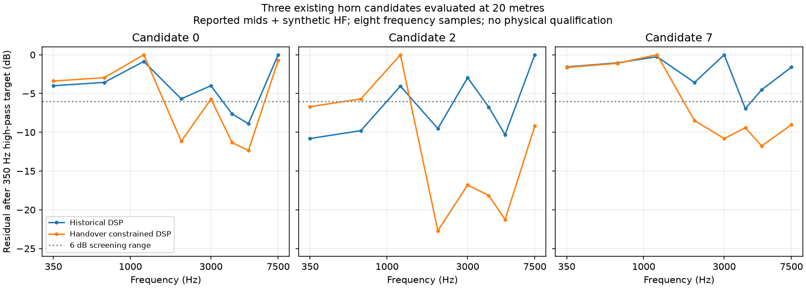

# Existing larger candidates at 20 metres

None of the three completed larger candidates meets the 6 dB sampled response
screen when evaluated at 20 metres with the mids required to dominate through
3 kHz. The best has 11.77 dB of response variation. This reanalysis preserves the
original geometry and full native voltage bases; it is not a new shape search.

The [original larger search](larger-target-experiment.md) produced completed
candidates 0, 2 and 7 at eight frequencies from 350 to 7,500 Hz. Their retained
BEM boundary pressure and normal derivative were projected independently for
each of five voltage excitations. The new observations include horizontal and
vertical cuts and 413 points on a sphere at 20 metres about the throat origin.
No coupled FEM/BEM system was re-solved and no pressure was inferred by applying
an inverse-square correction to the 1-metre response.

Before scoring, native projection at the original 1 metre reproduced all three
full H/V voltage bases within the predeclared 0.05 dB / 0.5° limits. Maximum
observed differences were 0.000000518 dB and 0.000001355°. Each trial had 5,840
complex samples. The declared 0.001 relative-null floor excluded one sample each
in candidates 0 and 7 and none in candidate 2. A diagnostic selection kernel
using the existing DSP, polar and sphere metric functions also reproduced every
original selected DSP and acoustic score from the original arrays within
`1e-10` absolute score tolerance.

## What changes at the declared distance

The middle column keeps each candidate's original DSP fixed. The final column
selects from the original gain/crossover/polarity/delay choices at 20 metres,
with whole-sphere scoring and the additional acoustic handover constraint:
coherent mid-bank pressure must dominate through 3 kHz and HF pressure from
5 kHz. Thus that column changes the constraints and scoring as well as the DSP;
it does not isolate distance alone.

| Candidate | Original 1 m variation | 20 m, original DSP | 20 m, handover constrained DSP |
| --- | ---: | ---: | ---: |
| 0 | 8.25 dB | 8.90 dB | 12.36 dB |
| 2 | 10.54 dB | 10.80 dB | 22.69 dB |
| 7 | 7.35 dB | 6.94 dB | 11.77 dB |

All variations are relative to the declared 350 Hz LR4 high-pass target. Every
candidate retains a parallel-mid bank above the 2-ohm impedance screen and its
original planning cost. Candidate 7 still has the best combined objective; its
new settings are mid gain 0.4, reversed mid polarity, 5 kHz electrical crossover
and 0.75 ms HF delay. These satisfy sampled channel dominance, but not the
response screen or a finished loudspeaker specification.

The curves are independently normalised to their maximum target residual for
comparison. The chart does not show absolute sensitivity or maximum output.
The eight-frequency grid can miss intervening response and handover failures;
it is not an independent frequency holdout. The ongoing denser vocal-range
geometry search is a separate experiment with its original controls.

## Provenance and limits

The [evidence manifest](../validation/evidence/audience-distance-candidates/report.json)
indexes four SHA-256/CRC-checked archives containing the projected input traces,
all per-excitation results, original scoring controls, diagnostic reports and
exact runners. Native coupled source was `a0a604e`; application functions for
preparation/reanalysis were frozen at `b13c176`; the pinned Boundary Lab
projection source was `8cb166226e412877d3f71f2845918e479b97aa85`, using CPU float32
and two Julia threads. The original native archives remain at commit
`e1696b3c963a44c6f36eb822adee71e99aef58ad`.

Twenty metres is a finite-distance diagnostic radius, not an established audience
requirement or a far-field qualification. The earlier
[20-to-40-metre stability failure](observation-distance.md) remains failed.
The original meshes remain unconverged, mids use reported circuits and HF is
synthetic. The original complex64 electrical-consistency storage failure remains
unchanged. There are no measured source, loudspeaker, commercial-mount or print
qualification claims.
