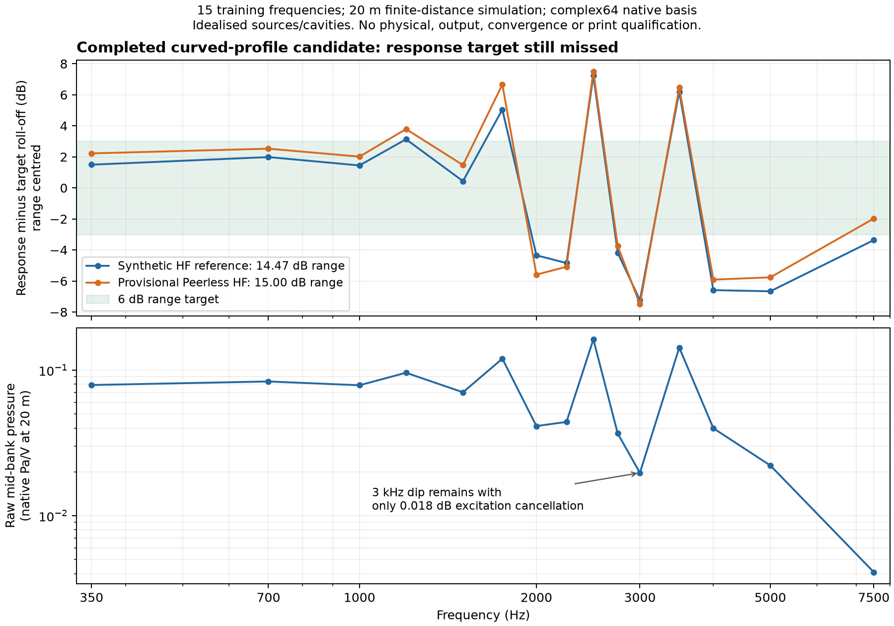

# Driver-circuit comparisons on fixed native acoustic geometry

`meh reanalyse-circuits` derives new voltage-driven fields from a complete,
verified native velocity basis. It can change circuit parameters and explicitly
modelled throat area transformation while retaining the exact acoustic geometry,
moving-boundary areas, medium and motion profiles. A geometry mutation, different
mid diaphragm area or changed acoustic medium still requires a new field solve.

This enables commercial-source and circuit-uncertainty comparisons without
discarding mutual loading or rerunning an unchanged FEM/BEM discretisation.
It does not add missing phase-plug geometry, breakup, nonlinear behaviour or
source measurements. Its output is explicitly derived evidence; native search
readers and build exporters do not treat it as a new completed native search.

## Reconstruction

At each frequency, use receiving components as rows and independent voltage
excitations as columns. The original native velocity and current matrices are
`V` and `I`. In the native outlet coordinate, the acoustic reaction is
`F = diag(Bl) I − diag(Zm) V`. Solving `Za V = F` reconstructs the discretised
acoustic load matrix. There is no inversion of a partial or rank-deficient basis.

With the replacement circuit, solve
`[Za + diag(Zm_new + Bl_new² / Ze_new)] V_new = diag(Bl_new / Ze_new) E`,
where `E` contains the original independent 2.83 V excitations. New coil currents
follow from the new electrical equation. Solving `V W = V_new` then supplies
the weights that recombine every retained complex pressure/normal-derivative
field. **Old coil currents cannot simply be recombined with those weights.**

The source model and compiled parameters must agree before reconstruction.
Both old and new physical circuits use the explicit outlet-coordinate conversion
when declared. The resulting velocity basis is in that native coordinate;
physical diaphragm velocity is obtained by dividing the relevant receiving
column by its source's outlet velocity ratio.

### Symmetric driver groups

The same reconstruction now supports X/XY models with several physical coils
represented by one voltage port. Every partner retains the same replacement
circuit and common drive voltage. Native currents and velocities are per coil;
the pressure basis already includes the complete excited group. Recombination
therefore needs no additional excitation multiplier. Moving-surface meshes
independently establish coil counts and surface completion, and every native
current/velocity metadata record must agree with them.

With unequal group sizes, the per-coil load matrix need not be symmetric.
Diagnostics use `sqrt(N) Za / sqrt(N)` for diagonal physical orbit counts `N`,
which expresses the load in coordinates normalised for total physical power.
The inferred per-coil matrix remains unchanged. Parallel-bank impedance and DSP
current reports sum all physical receiving coils.

An independent five-coil circuit test agrees with a three-group reconstruction
for changed circuits, induced motion, currents and arbitrary observation fields.
Metadata disagreement and a bank load that passes only when coils are omitted
are rejected.

At source `2b84de04dd02e37599b91dd46a60fae9742cf2ac`, identity reanalysis of both
retained production quarter-model candidates reproduces all native quantities
within `3.63e-16` relative L2 and preserves their scores and four-mid bank loads.
A separate changed-circuit comparison then replaces the HF with the provisional
Peerless ideal-outlet model and varies the synthetic mids' Re, Bl and Mmd. It
retains exactly the same 108,241 tetrahedra and 2,612 exterior triangles.

All 32 fresh-native versus derived quantity/frequency pairs pass the predeclared
`1e-8` relative complex L2 limit at 350, 1,000, 2,000 and 3,000 Hz. The maximum is
`7.399211303325249e-12`, in the 3 kHz BEM normal derivative. The fresh solve also
passes the separate `1e-8` electrical gate, with maximum reciprocity residual
`5.699618347716415e-10`. The [grouped evidence report](../validation/evidence/grouped-circuit-reanalysis/report.json)
indexes a [41,078,045-byte archive](../validation/evidence/grouped-circuit-reanalysis/evidence.zip)
of 135 verified files, SHA-256
`df9f76ca7db10eb974399a3c2556e7ad3f8ead8c4d87b4d25ca6f75a2c0b7f2f`.
These are circuit-equivalence checks on an existing discretisation, not physical
source accuracy or acceptance of the commercial horn design.

## Numerical screens and limits

Defaults reject a velocity basis or replacement circuit with condition number
above 1e6. The input voltage-equation residual screen is 1e-5, allowing exploratory
complex64 inputs; the new circuit/recombination algebra must agree within 1e-10.
These are declared reanalysis screens, **not a relaxation or pass of the separate
1e-8 native electrical gate**. The original assessment, input precision,
conditioning and residuals are retained. Complex128 calculations cannot restore
information lost in complex64 native storage. Acoustic-load reciprocity and its
Hermitian eigenvalue are reported without symmetrising, clipping or correcting
the inferred load.

Unit checks compare against independently solved physical driver equations on a
known reciprocal load, including induced current, volume flow, pressure and
changed outlet coordinates. The independent fresh native alternate-circuit
comparison below has passed. This establishes numerical agreement for that
discretised reference, not the accuracy of a commercial driver model.

## Executed independent native comparison

Runtime source `40e23d4` reconstructed the load from the original
[`ab6714f` periodic-profile reference](periodic-profile-evidence.md), then replaced
its synthetic HF with the [provisional Peerless ideal-outlet circuit](research/commercial-hf-source-audit.md).
The four synthetic mids, acoustic medium, geometry and all six compiled mesh
hashes were retained. A separate CAD compilation and fresh `coupled_reference`
solve evaluated the replacement circuit at 350, 1000, 2000 and 3000 Hz.

The relative complex L2 tolerance of `1e-8` was recorded before either the derived
arrays or new native arrays were produced. All 32 quantity/frequency pairs passed,
including exterior pressure, sphere and polar fields, FEM pressure, BEM traces,
driver velocities and coil currents. The largest error was
`5.832485738303627e-12`, in the 3000 Hz BEM normal derivative. The fresh native
result independently passed the unchanged `1e-8` electrical consistency gate;
its largest electrical reciprocity residual was `9.427044770619989e-9`.

The [evidence report](../validation/evidence/circuit-reanalysis/report.json) binds
archives containing the new native search, separate derived dataset, comparison
rows, predeclared controls and runners. The original native basis remains in the
[periodic-profile evidence archive](../validation/evidence/periodic-profile-symmetry/report.json).
The reanalysis retains the original load's numerical reciprocity and passivity
diagnostics without altering it to force agreement.

This small reference has synthetic mids, a disabled 2-ohm screen and a £100
fixture driver allowance. The HF record remains provisional, and its separate
unfitted plane-wave-tube comparison still fails the declared 3 dB screen. The
new reference's 12.46 dB selected response variation is not acceptance of the
full-size design. This experiment establishes neither mesh convergence nor
physical source, mechanical fit, print or output qualification.

## Run a comparison

Create a `HornSources` JSON by retaining a solved system's medium and side source
and replacing its `throat` with the desired driver's `source_model`. Retain its
provenance and explicit `ideal_outlet_area_m2`; the latter must match the solved
throat opening. Then run:

```sh
meh reanalyse-circuits runs/SEARCH/trial-000/system/project.blab.json \
  --evaluation runs/SEARCH/trial-000/evaluation \
  --sources runs/replacement-sources.json \
  --output runs/replacement-circuit-fields
```

The new directory contains `derived.json`, the circuit matrices and weights,
and separate recombined field arrays. It records original native identities,
replacement sources, limits and array hashes. The original project, evaluation,
search status and scores are untouched.

Add `--brief runs/SEARCH/brief.json` to select DSP for the replacement circuit
using the same scoring calculation as native optimisation. The complete frequency
grid and observation distance must match. The brief supplies acoustic objectives
and gain/crossover/polarity/delay choices, including its parallel-bank impedance
and acoustic handover constraints. The reported bank load uses the replacement
coil currents, including mutually induced motion.

`derived.json` then records `acoustic_scoring.controls`, the brief hash and a
separate `acoustic_scoring.score`. This is an acoustic comparison: it does not
check catalogue eligibility, replacement-driver prices or mechanical fit. No
derived score becomes a native search winner or manufacturing export, and the
original electrical assessment is not represented as a qualification of the
replacement source. A completed score is not itself acoustic acceptance.

If no DSP setting satisfies the constraints, the command fails and records the
failed scoring status and reason while retaining all recombined fields. Failed
experiments can therefore be inspected without weakening the declared constraints.

## Production scoring replay

Source `93da10c` uses one DSP kernel for both native and derived bases. Its
predeclared replay checked three preserved native scores: the small periodic
reference, the fresh alternate-HF reference, and completed trial zero of the
full-size periodic-profile search. All numeric values and selected DSP settings
were unchanged (2,527 numeric values compared; absolute limit `1e-10`).

The real `reanalyse-circuits --brief` CLI also reproduced the small fresh-native
alternate-HF score: the largest absolute difference across 508 numeric values
was `3.2009950245992513e-12`, below the declared `1e-8` limit. Its full-size score
matched the independently recorded circuit diagnostic exactly for the compared
metrics and settings, within the declared `1e-10` limit.

The [scoring evidence archive](../validation/evidence/derived-circuit-scoring/report.json)
contains the complete full-size native **trial zero**, derived fields, replay
controls and runners. The enclosing four-proposal geometry search was still
running at archival time; this is not a completed-search or winner claim.
The earlier unscored circuit fields were byte-identical to the new scored fields
and are retained once, with an explicit relocation map in the archive report.

### Full-size result remains outside the response target

On the 15 training frequencies from 350 to 7500 Hz at 20 m, the synthetic-HF
reference has 14.47 dB response variation; the provisional Peerless substitution
has 15.00 dB. Both fail the unchanged 6 dB screen. The replacement selects a 5 kHz
electrical crossover, positive mid polarity, gain 0.8 and 0.9 ms HF delay. Its
sampled acoustic handover satisfies mid dominance through 3 kHz and HF dominance
from 5 kHz; the predicted parallel mid-bank magnitude stays above 3.131 Ω.
These results do not qualify an amplifier or an acoustic design.



The upper plot removes the declared low-crossover roll-off and centres each
response range; connecting lines only join evaluated samples. The lower plot
uses one common mid-bank volt before DSP with the HF amplifier held at zero
volts. At 3 kHz, the coherent sum of the four mid-excitation fields is only
0.018 dB below the sum of their magnitudes, while the common response still dips.
Every excitation field includes mutually induced motion of all diaphragms; this
decomposition does not isolate a unique physical cause of the dip.

The full-size data retain complex64 native precision, the failed separate
electrical qualification gate, idealised cavities and unqualified sources. The
15-frequency grid is not held-out validation, and 20 m has not been qualified as
far field. No acoustic, output, source, mechanical-fit or print acceptance is
claimed by these scoring checks.
