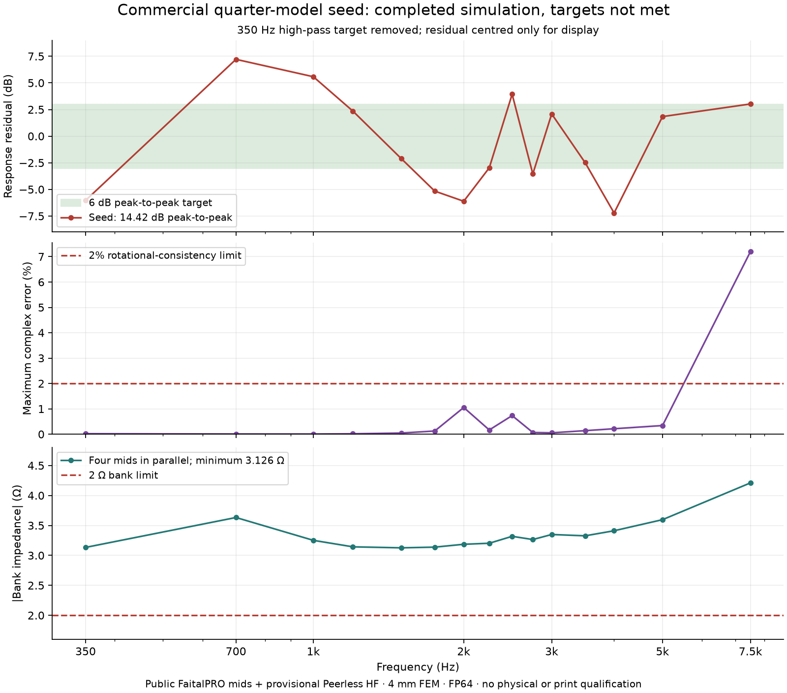

# Commercial quarter-model baseline

The public-driver seed now completes generated geometry, native coupled FEM/BEM
simulation and DSP scoring from 350 to 7,500 Hz. It does **not** meet the response
or upper-band numerical consistency targets. This is the completed baseline of
the twelve-proposal search, not its selected final design.

## Completed result

The model has four FaitalPRO 4FE32-16 mids sharing one horn, plus a provisional
Peerless DFM-2535R00-08 ideal-outlet compression-driver model. Public driver
parameters are retained with their source provenance; no manufacturer contact is
required to run this experiment. The full physical CAD and coil inventory remain
present while the acoustic domain uses verified XY mirror reduction.

| Check | Result | Declared limit |
| --- | --- | --- |
| Response residual, after the 350 Hz high-pass target | 14.4204 dB peak to peak, fail | 6 dB |
| Maximum rotation/axis/matrix complex error | 7.2014% at 7,500 Hz, fail | 2% |
| Electrical equation and reciprocity checks | Pass; maximum reciprocity residual 1.5792e-9 | 1e-8 |
| Four-mid parallel-bank minimum impedance magnitude | 3.1263 Ω, pass on sampled frequencies | 2 Ω |
| CAD material plus declared driver/hardware allowances | £254.74 | £300 |

The selected DSP has a 350 Hz mid high-pass, 4 kHz LR4 upper crossover, positive
mid polarity, mid gain 0.4 and 0.15 ms HF delay. The sampled acoustic handover
passes the existing requirement: mids dominate through 3 kHz and HF dominates
from 5 kHz. This does not repair the response failure. The costs are declared
allowances, not current supplier quotations, and the impedance result does not
qualify any particular amplifier module.

The native run uses 4 mm interior meshing, 10 mm nominal exterior meshing,
FP64 `coupled_reference`, and the unchanged 500,000 total tetrahedron / 10,000
final exterior triangle limits. The completed exterior has 8,064 triangles.
The geometry is the retained curved exponential-round seed with periodic profile
controls; subsequent proposals mutate angular shape, entry tilt and port geometry.

## Why the acoustic ranking remains exploratory

A separate comparison uses the previous full 8 mm FP32 seed and this quarter
4 mm FP64 seed. Their physical geometry and source circuits match; only the
meshing controls, domain reduction and backend differ. Observation coordinates
match exactly, full-model excitation pairs are summed coherently, and the new
seed's DSP is applied unchanged to both datasets. There is no fitted gain or
phase alignment.

The maximum raw-basis complex field/current/velocity difference is 84.9602%
(at 5 kHz, spherical pressure from the X mid pair). With fixed DSP, the maximum
observation-field difference is 71.4223% at 7.5 kHz. Both fail the retained 2%
diagnostic limit. Bank impedance differs by at most 1.7346% and passes that
limit. Similar response-ripple scores therefore do not establish stable acoustic
fields. Because this comparison changes several numerical settings, it cannot
identify which setting caused the discrepancy. A controlled commercial-band
refinement comparison is still required.

## Reproducibility and limits

[The evidence report](../validation/evidence/commercial-quarter-baseline/report.json)
and its archive retain the completed seed's CAD, meshes, native fields, score,
controls and standalone checks. They deliberately exclude the mutable whole-search
manifest. The older full-model native dataset remains in the linked
[exponential-round archive](../validation/evidence/nonlinear-commercial-exponential-round/report.json).
Both datasets retain their original source identity.

The application source is `188a933137c3d11f9df7bb7fa35c7f188827a6e1`;
Boundary Lab is `8cb166226e412877d3f71f2845918e479b97aa85`. The auxiliary rotation
controls preserve the earlier 2% limit, but were recorded after the first 350 Hz
result and before computed diagnostics. Their original wording, “after the first
frequency sweep”, was imprecise and is preserved with this correction. An initial
validator filename error is also retained alongside the corrected report; it did
not change native results.

No physical measurement, commercial source calibration, output qualification or
print qualification has been established. In particular, the ideal rear-cup
clearance has not been made to fit the published FaitalPRO basket dimensions.
This seed is not a build recommendation or evidence of Solana-equivalent performance.
