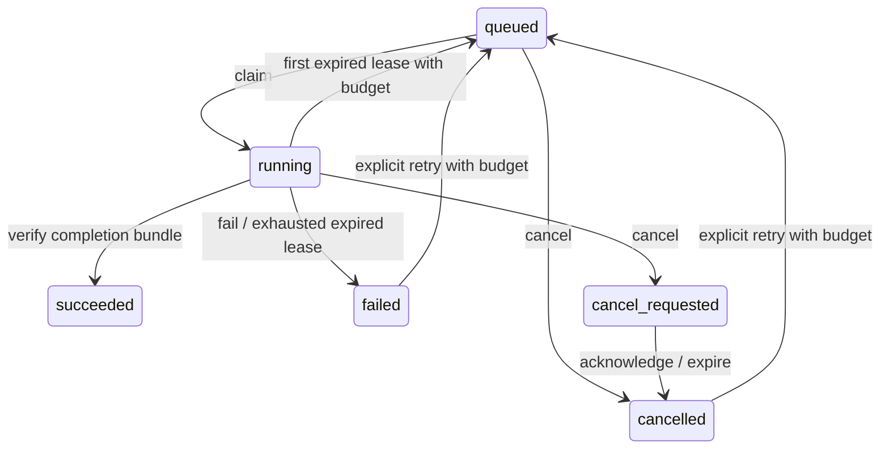

# Durable job ledger

`meh_studio.jobs` supplies the first B04 infrastructure: a SQLite job ledger, expiring worker leases, cancellation requests, bounded retries and hashed output bundles. It does not yet execute CAD or solver processes, choose compute resources, stop an operating-system process or supply an application queue UI.

A `JobSpec` contains an operation, an input digest, canonical JSON parameters and an attempt limit. The caller must construct the input digest from all material dependencies, including geometry, sources, runtime, fidelity and frequency request; the ledger does not discover or verify those input dependencies. Identical specifications deduplicate to the same content-addressed job. Parameters are stored as an immutable canonical JSON string, with non-finite values rejected.

```python
from pathlib import Path
from meh_studio.jobs import JobQueue, JobSpec

with JobQueue.create(Path("jobs.sqlite"), Path("job-artifacts")) as queue:
    job_id = queue.enqueue(JobSpec(
        kind="solve", input_digest="a" * 64,
        parameters_json='{"example_only":true}', max_attempts=3))
    lease = queue.claim("worker-1", lease_seconds=60)
```

The example digest is a placeholder, not an evaluation identity. Each process/thread must open its own queue connection. SQLite writer transactions make competing claims exclusive. Claiming commits an attempt record before returning work. A lease specifies a unique attempt directory; the worker creates it and writes its artifacts there.

Workers must renew leases while working. Heartbeat returns whether cancellation has been requested. An expired lease cannot renew, publish success or modify a newer attempt. Recovery marks the abandoned attempt failed and automatically requeues at most once per job, and only when its attempt budget remains; a pending cancellation becomes cancelled instead. A worker can explicitly fail an active attempt, and the caller can explicitly retry failed/cancelled work within the attempt budget. Explicit retries do not reset the automatic-retry allowance. All attempts remain recorded.



Completion requires a `completion.json` descriptor in the attempt directory. Its `Completion` record names the job, attempt token, worker-declared evidence category and a nonempty list of relative artifact paths, sizes and SHA-256 hashes. The worker must close all output files and stop modifying them before requesting publication. Every file must stay inside that attempt directory and match the descriptor. Hashing runs outside the database writer lock so another connection can request cancellation during verification. The lease and cancellation state are checked again before publication. A cancellation request cannot be overwritten by a late success.

The database retains the descriptor hash. Consumers must call `queue.result(job_id)` before using a bundle: it rechecks the descriptor and every artifact, detecting later archive damage. A stored `succeeded` state records successful publication in the past; it does not imply files remain intact without this check. The ledger does not make files immutable at the operating-system level or validate their acoustic contents. Evidence categories are worker declarations, not independent physical or numerical qualification.

The wall-clock lease model requires a reliable UTC system clock. Separate queue connections are safe for concurrent workers; one connection is not shared across threads. Recovery prevents late workers from publishing into the accepted attempt, but cannot stop an old process from consuming compute. Process supervision, resource ceilings, stage handlers, semantic result validation, resume checkpoints and optimizer integration are the next layer.

Tests include competing connections, an actual worker process exiting immediately after claim, lease expiry, late completion, cancellation races, bounded retry after reopening the database, missing/corrupted artifacts and overwrite refusal.

Completion descriptors are limited to 16 MiB before parsing; reads remain bounded even if a file grows during inspection. This includes both publication and later archive verification. Database schema 2 records the consumed automatic-retry allowance persistently; development schema 1 databases are rejected explicitly and must be recreated.
