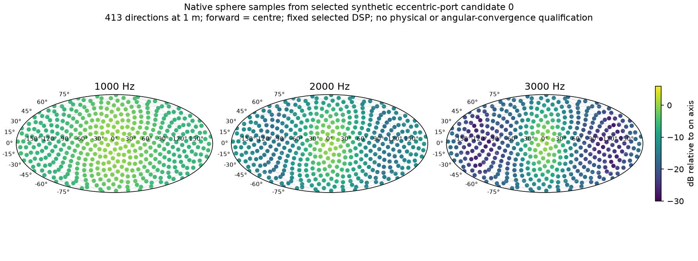

# Independent axial placement of mid ports and driver cavities

The larger baseline's saved common-mid-bank response drops sharply around 2 kHz
while diaphragm motion increases. Its internal FEM pressure field contains a
low-pressure zone at the entries. This motivates testing different entry paths;
it does not identify a proven cause or establish that a closer port will improve
the finished speaker. A new coupled solve must evaluate each changed geometry.

Previously each circular port and its driver cavity shared an axial centre.
The throat clearance rule therefore kept the port at least a front-cavity radius
plus wall thickness from the throat. That restricts entry positions for larger
mids even when an eccentric opening could fit inside the same cavity.

`HornGeometry.driver_axial_offset_m` moves the modelled circular front cavity,
source planes, rear cavity and rear cup relative to `entry_positions_m`, which
continue to specify port centres. Positive offset places the driver cavity
farther toward the mouth. The radial port enters the front cavity off centre;
its axis and the diaphragm motion axis remain radial. There is no synthetic
phase-delay substitute: both the CAD air domain and its material change and are
remeshed for the native FEM/BEM solve.

The port disk must fit strictly inside the front-cavity face:
`abs(driver_axial_offset_m) + port_radius_m < front_radius_m`. The port and cavity
have separate throat/mouth clearance checks. Adjacent ring cavity envelopes,
source areas, disjoint solids, back-wall coverage and all existing mesh checks
remain enforced. Clearance is for these modelled solids; actual basket, flange,
cone, mounting hardware and magnet geometry are not yet qualified.

For example, a model with a 20 mm front-cavity radius and 6 mm port radius can put
its port at 20 mm from the throat and its driver cavity at 30 mm, using a 10 mm
offset. The zero-offset version at that entry position is rejected because its
cavity crosses the required throat clearance. `examples/eccentric-ring-geometry.json`
records this geometry example, not an acoustically selected speaker.

The evolutionary search accepts signed `driver_axial_offset_m` bounds, while all
other dimensional bounds retain their positive-value requirement. Mutation,
constraint rejection, recorded geometry identity and replay include the offset.
An omitted or zero offset preserves historical serialized inputs and source
locations. Existing experiments remain unchanged.

The active historical large search has no offset gene and continues with its
original source. A follow-up search should explore the new degree of freedom
alongside port radius/length, cavity depth and profile, using whole-sphere
observations and retaining failed proposals. Any acoustic benefit remains to be
established with frozen-DSP frequency holdouts and mesh checks.

## Completed native integration study

A separate two-proposal study from frozen application source `1187c25` completed
both CAD → mesh → coupled FEM/BEM → DSP scoring evaluations. Each evaluation
solved 350, 1,000, 2,000 and 3,000 Hz, with 413 spherical observation directions
per frequency as well as horizontal and vertical cuts. The second proposal
mutated the irregular profile and cavity offset from the first result. Its
objective worsened from 19.4196 to 19.7452, so the first candidate remained the
winner. Recomputed ancestry and scores passed export verification.

This is a deliberately small, synthetic integration fixture: 125 mm horn length,
50 mm nominal mouth radius, four mid ports at 20 mm and initial driver cavity
centres at 40 mm. Its selected upper crossover is 2 kHz. These are diagnostic
inputs, not the commercial 350 Hz / wide-vocal-range design. The winner's
target-relative response range is 14.1548 dB and its spherical target RMS error
is 14.6775 dB over the scored 1–3 kHz frequencies. Neither establishes acceptable
performance. The second candidate's response range is 14.4637 dB.

The chart shows individual native observations with the selected DSP, without
interpolation into unobserved directions. Sampling is not a radiated-power
qualification or an angular-convergence study. Strict electrical validation
remains failed because this backend stores complex64 responses. The impedance
screen was explicitly disabled for this synthetic diagnostic: its roughly
1.50 Ω minimum bank impedance does not qualify it for the user's 2 Ω amplifier.

The [evidence report](../validation/evidence/eccentric-sphere-search/report.json)
records exact sources, archive hashes and export checks. Trial archives retain
complete geometry, meshes and raw complex fields. `controls-and-export.zip`
includes the verified geometry bundle and exact runners; the separate
[1 Vrms operating report](../validation/evidence/eccentric-sphere-search/operating-1vrms.json)
retains the numerical and physical qualification flags.

Initial attempts are retained too: an incompatible synthetic cavity radius,
profile bounds that excluded the base shape, and two native preflight failures
caused by binary mesh output. The final run uses lossless ASCII mesh output for
the pinned runtime's text reader. These failures were corrected through input
or format fixes; no acoustic acceptance threshold was relaxed.
