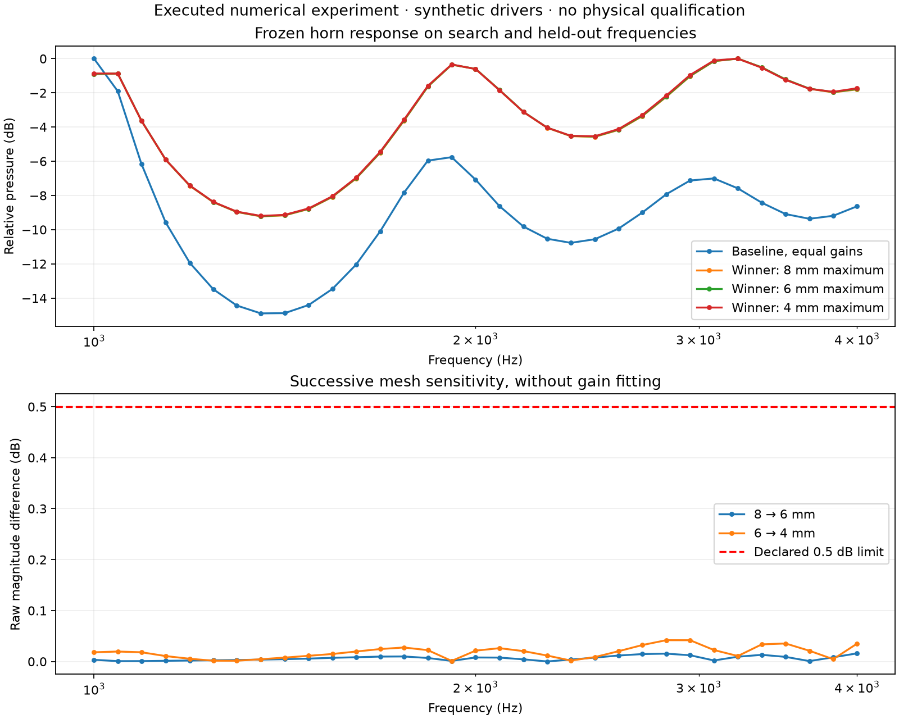
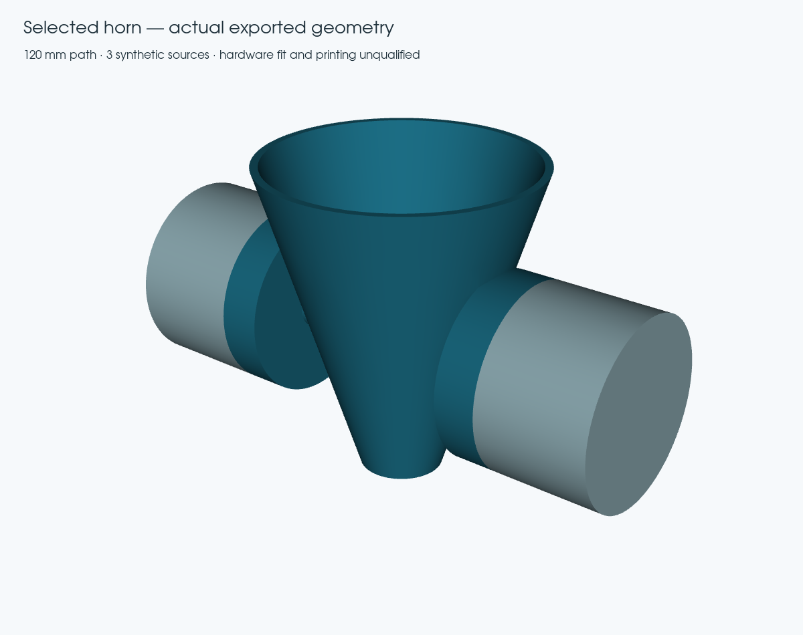

# Executed horn optimisation and numerical validation

The complete numerical pipeline passed across the [original native run](https://github.com/timini/meh-design-studio/actions/runs/34370258164) and [successful acceptance replay](https://github.com/timini/meh-design-studio/actions/runs/34384322949): catalogue loading, constrained search, CAD and mesh generation, coupled FEM/BEM simulation, frozen-finalist validation and geometry export. This demonstrates the experimental CLI; it does not establish a high-fidelity or physically qualified speaker.

All 68 validation solves completed in the original run. Its final assembly job failed during runner setup because an unrelated Chrome package mirror returned a checksum mismatch. The replay restored the original source and raw files at their original paths, verified their identities, and passed the unchanged acceptance gates. No acoustic solves or raw files were modified to recover the run.

The executed source is `ca3e8caf4f9c2437a8b3c3f22b5bee7cb54cb610`. Subsequent review fixes add input/evidence guards and improve workflow recovery; they are not represented as new executions of the solver.

| Check | Result |
|---|---|
| Search | 4 candidates, 17 frequencies from 1000 to 4000 Hz |
| Baseline search ripple | 14.883 dB |
| Selected horn | 120 mm path, 100 mm mouth diameter |
| Selected search ripple | 9.016 dB |
| Held-out ripple improvement | 3.771 dB; required at least 1 dB |
| Frozen validation | 33 frequencies, three mesh resolutions |
| Raw mesh stability | PASS: maximum 0.042 dB and 0.70°; limits 0.5 dB and 5° |
| Finest sampled ripple | 9.195 dB |
| Coupled electrical consistency | False — complex64 remains unsupported by the strict check |
| Physical / print qualification | Not performed |

The driver parameters and prices are synthetic. The finite conical-family search
is not a global optimiser or an efficiency calculation. The selected geometry
still needs practical driver interfaces, sealing, print planning and measurements.

## Validation findings

Earlier experiments on the larger 500–2000 Hz horn used sparse sampling that hid a response peak. An earlier uniform mesh also changed
the throat area by 6.45% and failed the declared refinement gate. Those experiments
were retained as failures. The corrected generator resolves curved boundaries and
independently checks saved source areas against CAD within 1%. A compact case subsequently exposed missing front-chamber back walls. Material coverage is now checked independently of solid validity. Its 20 mm exterior mesh also failed CAD-volume agreement; the successful compact benchmark uses a 10 mm exterior target. No acoustic acceptance
threshold was relaxed. The compact and larger horn experiments remain separate. The final experiment freezes the selected driver gains and
adds frequencies that were not used to select the winner.

Refinement changes the interior mesh and its conforming BEM mouth interface while
holding the rigid exterior target fixed. This is not independent full exterior
convergence, nor a guarantee between the sampled frequencies. The analytic tube
reference separately checks an exact solution and strict electrical equations.

## Evidence and reproduction

- [Recorded results, acceptance limits and software identities](../validation/reports/end-to-end-search.json)
- [Exported STEP, STL and 3MF geometry](../validation/artifacts/experimental-horn.zip)
- [Reproduction commands](end-to-end-search.md)
- [Archived raw solver evidence and acceptance results](https://github.com/timini/meh-design-studio/releases/tag/numerical-e2e-2026-09-09)
- [Archive checksums and run identities](../validation/reports/end-to-end-evidence-index.json)

STL units are millimetres. Export checks assess closure, orientation and agreement
with CAD volume; they do not qualify mounting hardware, supports, material strength
or an actual print. The release preserves the raw artifacts beyond temporary Actions retention.

