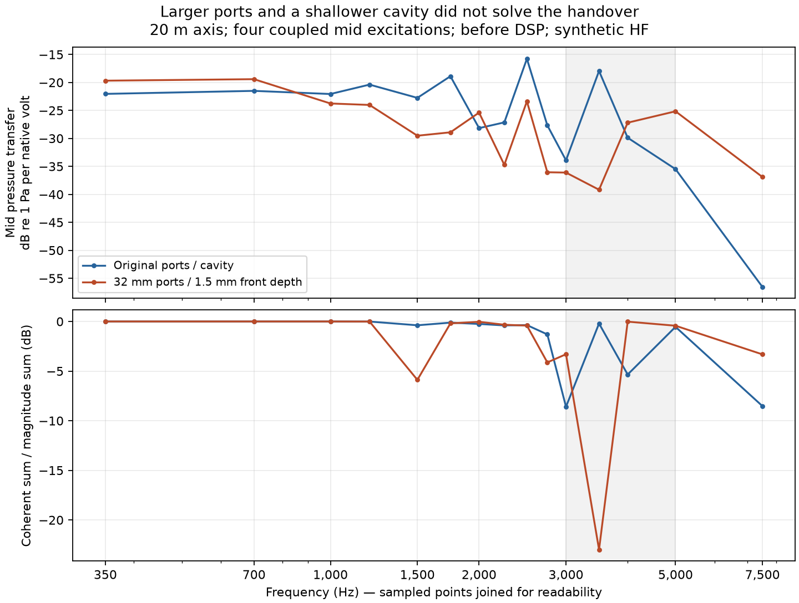

# Larger ports: completed simulation, failed acoustic handover

Increasing the four port radii from 19.0243 to 32 mm and reducing the idealised
front-cavity depth from 2.43068 to 1.5 mm did not produce a feasible target horn.
The native five-source FEM/BEM solve completed all 15 frequencies. All 252
declared DSP combinations failed the requirement that mids dominate through
3 kHz and HF dominates from 5 kHz. The search and its trial remain **failed**;
there is no winning DSP, valid winning response score or selected build export.

The other controls match the previous dense candidate: reported FaitalPRO 4FE32
16-ohm mid circuits, synthetic throat source, legacy asymmetric profile,
300 mm length, 220 mm nominal mouth radius, and full coupled driver motion.
The new solve observes the two 73-point polar cuts and 413-point sphere at 20 m.
Its 15 frequencies are 350, 700, 1000, 1200, 1500, 1750, 2000, 2250, 2500,
2750, 3000, 3500, 4000, 5000 and 7500 Hz. The earlier basis was separately
[projected and verified at the same distance](periodic-profile-evidence.md).

Each mid-excitation column includes motion induced in **all** drivers. Summing
the four columns represents their common amplifier voltage, with the HF
amplifier held at zero voltage. The lower plot compares this coherent sum with
the sum of individual column magnitudes; it is an algebraic cancellation
diagnostic, not an isolated measurement of a particular cavity or diaphragm mode.
The new variant's 3.5 kHz sum is 22.99 dB below its magnitude sum. Both port radius
and cavity depth changed, so their individual effects are not isolated.

## Why adjusting the gain cannot rescue this filter family

For each tested LR4 crossover, the diagnostic computes the minimum continuous
mid gain needed for mid-channel magnitude dominance on the sampled band through
3 kHz. It also computes the maximum gain consistent with HF dominance from
5 kHz. The 350 Hz mid high-pass is included. HF gain is one; all mids share the
same gain. These channel magnitudes include the coupled native responses.

| Electrical crossover | Minimum mid gain | Maximum mid gain | Feasible interval |
| --- | ---: | ---: | --- |
| 3 kHz | 3.29247 | 1.56012 | None |
| 4 kHz | 1.04176 | 0.493631 | None |
| 5 kHz | 0.426704 | 0.202191 | None |

In every row, 3 kHz sets the lower bound and 5 kHz sets the upper bound.
The lower bound exceeds the upper by a factor of approximately 2.11.
Polarity and delay rotate each channel's phase without changing its magnitude,
so they cannot open this interval. This is stronger than a failure of the six
discrete gains to sample a feasible setting. It does **not** exclude different
filter families, equalisation or a different physical design.

The sampled parallel-mid impedance magnitude has a minimum of 3.10799 ohms,
above the unchanged 2-ohm search screen. The planning cost is £261.10 against
the £300 ceiling, including £180 declared driver allowance and £55 other costs.
Neither result qualifies a particular amplifier or a manufactured assembly.

## Reproducible failed experiment

The [archive report](../validation/evidence/large-port-handover/report.json)
links the full failed search, geometry, meshes, completed native fields, original
logs, prewritten controls and exact diagnostic/archival runners. It also binds the
previous comparison basis to the [periodic-profile evidence](periodic-profile-evidence.md).
Native source is `c36e357`; the later gain diagnostic uses `ab6714f`. BoundaryLab
is pinned to `8cb166226e412877d3f71f2845918e479b97aa85`, `beat_cpu`, four Julia
threads, with a 7200-second stage allowance. The native evaluation completed in
2452.54 seconds. The outer search error says no candidate completed an evaluation;
its more specific trial error and complete native manifest establish that this
was a **scoring rejection**, not an incomplete solve.

The archival runner re-verifies the native assessment, the baseline frequency
assembly and projected-array hashes. Archives pass SHA/CRC checks. No native
status, controls or validation limits were changed to obtain this diagnosis.

This remains an exploratory complex64 result, which does not qualify the
separate 1e-8 electrical-consistency gate. It supplies no commercial HF source
qualification, cone/motor fit, held-out or mesh-convergence result, established
far-field distance, physical measurement or print qualification. The cavity
depth is an idealised control, not measured air volume around a real cone.
