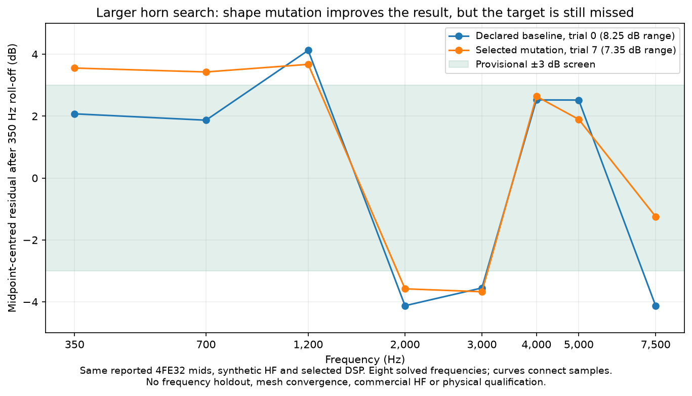
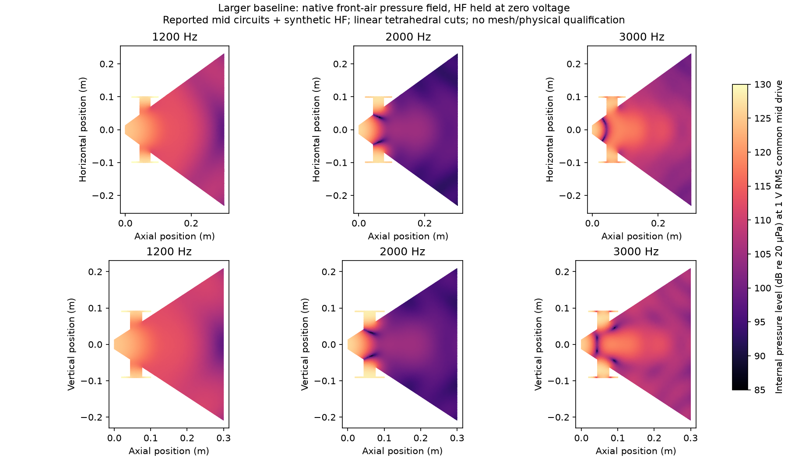

# Larger 350 Hz horn search

An eight-proposal evolutionary search explored a larger horn with four reported
FaitalPRO 4FE32 16-ohm mid circuits and an explicitly synthetic HF placeholder.
Three proposals completed all eight native coupled frequencies; five failed
geometry or interface compilation. The selected mutation improved the sampled
response and coverage scores, but did not meet the provisional response limit.
This is a completed exploratory numerical search, not a finished speaker.

The baseline is 300 mm long, with a 220 mm nominal mouth radius, mildly elliptical
profile, a four-driver entry ring at 60 mm, 16 mm port radii, 3 mm front-cavity
depth and 70 mm rear depth. The search varied profile controls, length, mouth
radius, entry position, port radius/length and front-cavity depth. Every completed
candidate was remeshed and solved at 350, 700, 1,200, 2,000, 3,000, 4,000, 5,000
and 7,500 Hz with full coupled driver voltage bases and horizontal/vertical cuts.

| Trial | Result | Target-relative response range | H/V coverage target error | Total objective |
| --- | --- | ---: | ---: | ---: |
| 0 | Baseline completed | 8.2486 dB | 6.7434 dB | 12.0558 |
| 1 | Mouth interface compilation failed | — | — | — |
| 2 | Mutation completed | 10.5372 dB | 7.1669 dB | 14.5566 |
| 3 | Mouth interface compilation failed | — | — | — |
| 4 | Material envelope did not contain horn air | — | — | — |
| 5 | Mouth interface compilation failed | — | — | — |
| 6 | Mouth interface compilation failed | — | — | — |
| 7 | Selected mutation completed | 7.3464 dB | 6.4123 dB | 10.9881 |

Trial 7 is a recorded mutation of trial 0. It increased the port radius to
19.0243 mm, reduced front depth to 2.4307 mm and changed six profile controls.
Both selected the same DSP: mid gain 0.2, 350 Hz high-pass, 3 kHz upper crossover,
positive mid polarity and 0.75 ms HF delay, using the modelled analogue LR4
filters. The improvement therefore does not come from changing those DSP
settings. It remains a comparison between unconverged meshes in this source
model, without a frequency holdout or a matched random-search benchmark.

The winner's sampled minimum parallel-bank impedance magnitude is 3.1377 Ω;
four mids share one ideal voltage-source amplifier channel. This passes the
declared 2 Ω screening value at these frequencies, not a specific amplifier
qualification. The frozen build estimate is £261.30: £180 in driver allowances,
£26.30 in modelled material/process allowance and £55 in other parts allowance.
Those are planning inputs, not supplier quotes or a fully mounted, sliced build.

The [evidence report](../validation/evidence/larger-wide-mid/report.json) records
the original application source `a0a604e`, pinned native runtime, all trial
outcomes, raw archive hashes and verified export. Export and explicit 1 Vrms
operating calculations use source `1187c25` without relabelling the original
solves. The [operating report](../validation/evidence/larger-wide-mid/operating-1vrms.json)
retains complex pressure, all driver currents/motion, excursion and electrical
power. Native complex64 storage still fails the unchanged strict complex128
electrical-validation requirement. No maximum clean output is established.

## Entry-path diagnostic

The baseline's saved common-mid pressure fields show low-pressure regions near
the entries around 2 kHz. The figure below uses the actual FEM tetrahedra and
linear interpolation onto the two section planes, with every mid at 1 Vrms and
the HF source held at zero voltage. It is a baseline diagnostic, not the winner.

CAD inspection also shows why the nominal 6 mm port-length parameter cannot be
read as the complete acoustic duct length. At the port centre line, the gap from
the unported horn surface to the cavity back face is about 40.82 mm horizontally
and 37.50 mm vertically. Keeping driver centres fixed while moving the ports
20 mm toward the throat increases those gaps to 55.45 mm and 50.52 mm. The
measurement script and values are archived with the controls. These are geometric
distances, not effective acoustic lengths or a prediction of a resonance.

A separate follow-up uses the merged independent-port placement and full-sphere
observations to test that trade-off on a denser vocal-frequency grid. The moved
ports must be resimulated; no benefit is assumed. The old failed mouth-interface
trials retain their original status even though the subsequent
[coordinate-restoration fix](mouth-coordinate-restoration.md) is now merged.

Commercial HF source/load data, actual basket/flange/cone geometry, full-band
numerical convergence, physical source and speaker measurements, and print
qualification remain open. More search within this placeholder source model
cannot establish Solana-equivalent physical performance.
