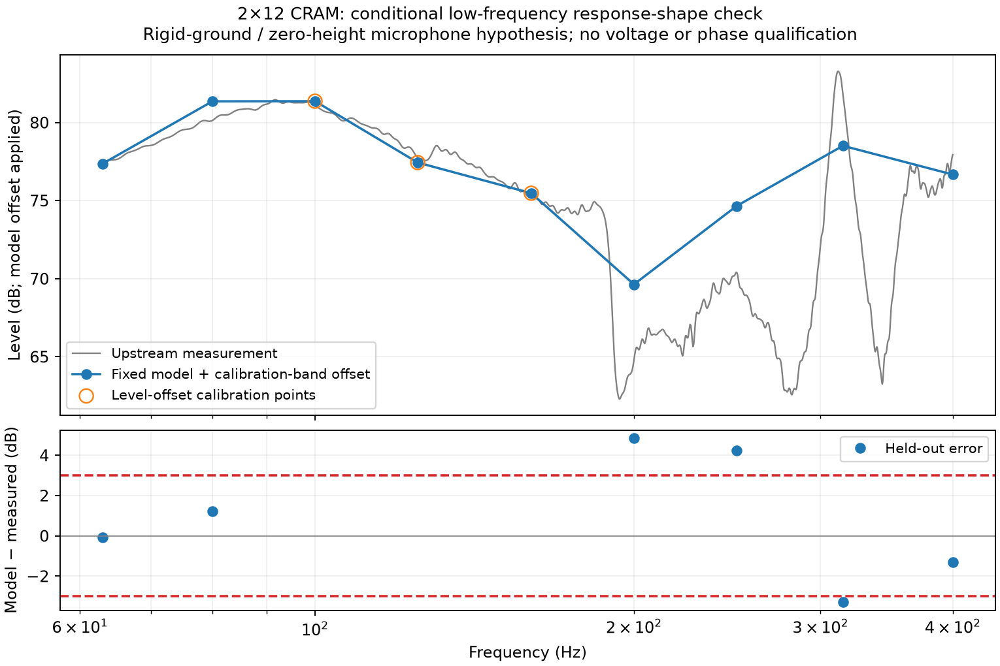

# Measured low-frequency reference and named-volume verification

The supplied Boundary Lab `2x12_CRAM` example now completes the adapter's
FP64 coupled solve and result verification. A conditional comparison against
the measurement supplied with that example **fails** its predeclared 3 dB
response-shape limit: maximum held-out error is 5.193 dB, RMS 3.211 dB.
This is not physical validation of the solver or the target MEH.

## Integration correction

The source project selects its interior volume by physical name `interior`,
with a null numeric tag. The native compiler supports this, but the adapter's
result verifier previously collected numeric tags only. It selected no source
tetrahedra and rejected the otherwise complete native result with
`FEM source requires supported same-order tetrahedra`.

The verifier now resolves physical names from the independently hashed source
mesh's `field_data`, checks volume dimension, and requires agreement if a numeric
tag is also supplied. Numeric-only groups remain supported. The existing source
hash, tetrahedron order, topology, connectivity and node checks remain in place.
The correction does not change meshing, native equations or solver tolerances.

The original failed adapter evaluation from `5c5fab1` is preserved. Reinspection
with the corrected verifier is recorded separately. A fresh end-to-end run from
frozen commit `c217b86ba76a2c10c6032091bfded518180fa5d4` passes verification,
with all 63 native result arrays exactly equal to those in the original attempt.
The two attempts have identical physical inputs and sampling controls.

Passing artifact verification does not mean passing the independent electrical
qualification screen. That screen still fails its unchanged `1e-8` relative
reciprocity limit: the maximum residual is `8.096e-5` at 125 Hz, despite FP64
storage. Circuit-voltage residuals are below `4e-16`. These results are retained
inside the comparison's source evidence; numerical convergence of the
reciprocity discrepancy has not been established for this example.

## Fixed comparison protocol

The [upstream example](https://github.com/JWSound/boundary-lab/tree/8cb166226e412877d3f71f2845918e479b97aa85/examples/2x12_CRAM)
contains the project, meshes, `Measured/Onaxis.txt` and measurement notes. Their
original hashes are retained. The model's two fractional physical drivers,
x symmetry, air properties, circuits and bulk losses were unchanged. Only
observation preferences changed: no spherical sampling and 15-degree H/V steps.

Before native evaluation, the experiment declared nine frequencies from 63 to
400 Hz. Both physical drivers receive coherent 1 V RMS, reconstructed from
the complete independent 2.83 V excitation bases. A single additive level offset
is the mean measured-minus-predicted difference at **100, 125 and 160 Hz only**.
Measurement SPL is interpolated in log-frequency. There is no phase comparison,
frequency-dependent correction, source fitting, loss fitting or geometry fitting.

| Held-out frequency (Hz) | Offset-adjusted model minus measured (dB) |
| ---: | ---: |
| 63 | −0.004 |
| 80 | +1.315 |
| 200 | +5.193 |
| 250 | +4.538 |
| 315 | −3.299 |
| 400 | −1.298 |

The calibration offset is +9.907 dB. Three of six held-out samples exceed the
unchanged ±3 dB limit. The nine-point simulation is a sparse comparison; it does
not resolve all the narrow features visible in the measured response.

## Interpretation and evidence

The measurement notes describe ground-plane acquisition 10 m from the DUT front,
without voltage calibration or a timing reference. The supplied model uses a
free exterior domain with x symmetry. Ground loading and microphone height are
unmatched; exact measured build revision and source/loss calibration are also
not independently established. Those differences prevent attributing this error
to a particular numerical or physical mechanism. Even a passing shape screen
would not qualify absolute SPL, phase, the commercial HF model or our wide-mid
horn. Matching the physical reference conditions is still required.

The [evidence report](../validation/evidence/measured-cram-reference/report.json)
and its archive preserve both native attempts, original source files, controls,
comparison plot, reinspection, runners, hashes and upstream licence. The original
failed evaluation remains failed. Local verification passed 758 tests, with
three platform-dependent skips and 26 CAD tests deselected; the meaningful code
increment received one bounded review with no material findings.

## Separate rigid-ground experiment

A new calculation from application source
`93344da6eb9f944541be07c979f9f6d721414169` tests whether ground loading explains
the earlier shape mismatch. It places the cabinet's minimum-Y base on `y=0`,
its maximum-Z front on `z=0`, and the microphone at `[0, 0, 10]` metres.
The existing x reflection reconstructs the cabinet; an added y reflection
represents an infinite rigid ground plane. Pressure-acoustic symmetry has this
sound-hard interpretation; see the [COMSOL BEM boundary-condition reference](https://doc.comsol.com/6.3/doc/com.comsol.help.aco/aco_ug_pressure.05.078.html).

Only 133 rigid bottom facets are removed from the BEM surface. Every retained
facet's coordinates and physical tag are verified unchanged before applying the
same rigid translation to both FEM and BEM meshes. The first attempt retained
62 unused BEM vertices and failed a singular factorisation before producing any
frequency result. A separate retry removes those unused vertices, remaps their
connectivity and proves that the retained facets are unchanged. It completes all
nine frequencies with 1,905 BEM triangles and the original 81,691 tetrahedra.
The failed attempt and its controls remain preserved. A bounded review
independently identified the unused-vertex problem addressed by the retry.

The two real drivers each have a ground image. The native geometric model thus
counts four coils, but the images are a boundary condition, not extra physical
hardware. The microphone pressure is the sum of the two independent 2.83 V
excitation bases divided by 2.83, with no extra image-count multiplier. Only the
on-ground on-axis observation is compared; below-ground polar coordinates are
mathematical image extensions and are not physical measurements.

No driver circuit, damping, cabinet dimension or frequency-dependent correction
is fitted. The original nine frequencies, three level-offset calibration points,
six held-out points and ±3 dB limit remain unchanged.

| Held-out frequency (Hz) | Ground-model minus measured (dB), offset applied |
| --- | ---: |
| 63 | −0.068 |
| 80 | +1.223 |
| 200 | +4.848 |
| 250 | +4.250 |
| 315 | −3.286 |
| 400 | −1.291 |

Maximum held-out error is **4.848 dB**, RMS **3.042 dB**; three of six samples
still fail ±3 dB. The calibration offset is +3.647 dB. Ground loading reduces
the earlier maximum error only slightly, from 5.193 dB, and does not resolve the
mismatch. The electrical reciprocity check also fails its unchanged `1e-8`
limit, reaching `1.032e-4` at 125 Hz; voltage-equation residuals remain below
`3.3e-16`. Neither comparison passes qualification.

The floor is assumed perfectly rigid and the cabinet upright on its base. The
measurement notes do not establish floor impedance, exact pose, feet, microphone
capsule height or build revision. This is therefore a declared reference-condition
hypothesis, not fully matched physical validation. It does not qualify the MEH,
absolute sensitivity, phase or source behaviour.

[Ground-reference evidence](../validation/evidence/cram-ground-reference/report.json)
preserves both attempts, original input files, nine-frequency native fields,
controls, comparison code, upstream licence and the inspected figure. All 75
archive members pass SHA-256 and CRC checks. The 11,246,675-byte archive SHA-256 is
`deb8945ceef4a3f892e863a4b663f7cc0df10fe7469f08a07b58496a75296ecd`.
