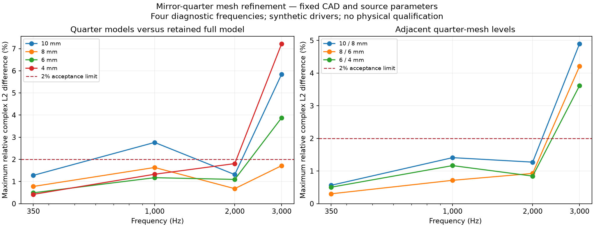

# Mirror driver groups and electrical validation

11 September 2026

The electrical validator now accounts for multiple physical coils represented by
one symmetry-reduced voltage port. Its unchanged `1e-8` reciprocity and passivity
checks use the group's total current. Its Kirchhoff voltage check still uses the
current through one physical coil.

If native response `C[e, j]` is the current in representative coil `j` when
voltage port `e` is driven with reference voltage `Vref`, and `n[j]` is the
number of physical coils in that representative's symmetry orbit, then

```text
Ygroup = diag(n) C.T / Vref
Igroup = Ygroup Vgroup
Prms = real(conj(Vgroup).T Igroup)
```

Completing a diaphragm cut by a symmetry plane does not add another coil.
Consequently, the surface-completion factor does not multiply electrical current.
For example, an XY quarter model can contain a quarter of the central HF
diaphragm and halves of two mid diaphragms: completion factors are `[4, 2, 2]`,
while physical coil counts are `[1, 2, 2]`. Those three representatives describe
five physical drivers.

The validator independently derives these counts from the hashed source meshes:
it resolves each moving boundary's physical surface, finds edge-connected
diaphragm patches, and checks which active symmetry planes cut their perimeter.
Front and rear patches must imply the same completion. Both velocity and current
metadata must agree with the mesh at every frequency. The unchecked compiled
system file is not used as the authority for multiplicity. Legacy unreduced
artifacts without multiplicity metadata retain their original interpretation.

An analytic regression independently solves three coupled physical drivers and
compares their electrical power with the two mirror-group ports. Corrupted
metadata, inconsistent disconnected surfaces and nonreciprocal responses are
rejected or fail the numerical checks.

## Retained native quarter-model experiment

The original standalone prototype used the tilted synthetic-source baseline from
[the tilted-entry study](tilted-mid-entries.md). The later
[quarter-model workflow](quarter-model-workflow.md) integrates reduction into
the geometry/search compiler after a matched-discretisation native check. CAD volume partitions and source areas
were checked before meshing. Two earlier CAD preparation failures are retained:
a coincident-face Boolean reconstruction and insufficient default integration
accuracy for a trimmed spline mouth. Partition containment/volume checks and
adaptive surface integration completed at the original `1e-6` limits.

The resulting quarter model contains 36,019 tetrahedra and 674 exterior
triangles. The FP64 coupled FEM/BEM solver completed at 350, 1,000, 2,000 and
3,000 Hz. Its three voltage ports represent HF, the X mid pair and the Y mid
pair. Asymmetric excitation of individual members of a mirrored pair is outside
this model's supported excitation space.

| Check | Result | Acceptance |
| --- | --- | --- |
| Corrected group-current electrical reciprocity | Maximum `7.809240366e-10`; pass | `1e-8` |
| Common parallel mid-bank complex impedance versus full model | Maximum 0.13593% difference; pass | 2% |
| Corresponding observation/transducer vectors versus full model | Maximum 5.84685% difference; fail | 2% relative complex L2 |

The largest field difference occurs in the 3 kHz spherical observation vector
for the Y mid pair. The quarter and full meshes are generated independently;
this comparison includes discretisation differences. The quarter solve took
22.28 seconds, but that is not an isolated performance benchmark and the failed
field comparison prevents treating it as a qualified search shortcut.

The original unweighted electrical report remains in the evidence. A separate
reanalysis identifies the exact new postprocessor source files while retaining
the original native source commit `9fdafd6a57e4f83ef24562a471ddb059dcc0b686`.
Neither native fields nor acceptance limits changed. Both unreduced tilted
candidates retain identical electrical reports, including their
failures. All four CRAM integration-study cases retain identical original
metrics and failures; their cut diaphragms each represent one physical coil.

The [evidence report](../validation/evidence/mirror-driver-validation/report.json)
indexes the raw quarter-model artifacts, preparation attempts, original
comparison and corrected reanalysis. Full-model reference fields remain in the
[tilted-entry archive](../validation/evidence/tilted-entry-search/report.json);
CRAM regression references remain in the
[quadrature archive](../validation/evidence/bem-quadrature/report.json).

Mesh refinement and an independent full-model comparison must resolve the field
discrepancy before mirror reduction can support search decisions. These results
do not qualify commercial driver inputs, physical acoustic accuracy, output
capability or printable driver fit.

## Four-level mesh refinement

The same quarter CAD was subsequently meshed at interior/exterior sizes of
8/16, 6/12 and 4/8 mm, keeping driver parameters, observations, frequencies,
solver backend and acceptance limits fixed. Native runs used source commit
`25e69a8575077df2c533ccab6db13ee4a823cc53`. The original 10/20 mm quarter and
full-model fields still have their original source identity; their new electrical
assessment uses the corrected postprocessor.

| Quarter mesh, interior/exterior | Tetrahedra | Exterior triangles | Maximum field difference from retained full model |
| --- | ---: | ---: | ---: |
| 10/20 mm | 36,019 | 674 | 5.84685%; fail |
| 8/16 mm | 41,729 | 974 | 1.71519%; pass |
| 6/12 mm | 57,006 | 1,630 | 3.87816%; fail |
| 4/8 mm | 108,304 | 3,328 | 7.21882%; fail |

The adjacent quarter-mesh differences are 4.89791%, 4.20802% and 3.61347%,
respectively, normalised by the finer model. Each fails the original 2% limit.
Their largest differences occur in the 3 kHz mid-pair radiation fields. The
isolated 8 mm comparison pass therefore does not demonstrate convergence or
justify choosing that mesh as a search screen. The existing full model has not
itself demonstrated convergence, so its role as a comparison reference does not
make its fields the exact solution.



All three new quarter models pass the unchanged electrical checks; maximum
reciprocity residuals are `9.97592e-10`, `4.75146e-10` and `2.27199e-10`.
Parallel-bank impedance comparisons also pass 2%. These checks do not resolve
the acoustic-field discrepancy. No gain, delay or phase alignment was fitted,
and all corresponding vector quantities and supported excitation groups were
included.

The [refinement evidence report](../validation/evidence/mirror-quarter-refinement/report.json)
indexes the three new raw native evaluations, meshes, frozen controls, original
failed comparison attempt made before solver finalisation, completed comparisons
and plotted data. The native and postprocessing identities are distinct and
explicit. The next numerical work must establish stable fields and separate
full-model discretisation error from symmetry-reduction behaviour before this
shortcut is integrated into production optimisation.

The subsequent [3 mm refinement and physical-bank scoring correction](mirror-bank-scoring.md)
passes the 4/3 mm adjacent field comparison, while still failing against the
older full reference. It also verifies that the scorer rejects a physical bank
below the 2-ohm load constraint when mirrored coils are included.

The subsequent [matched half/quarter comparison](quarter-model-workflow.md#matched-discretisation-native-check)
passes at 0.00112979% maximum field difference using the same element shapes.
This separates tested mirror behaviour from the independent-mesh discrepancy
without changing any older result or establishing physical qualification.
