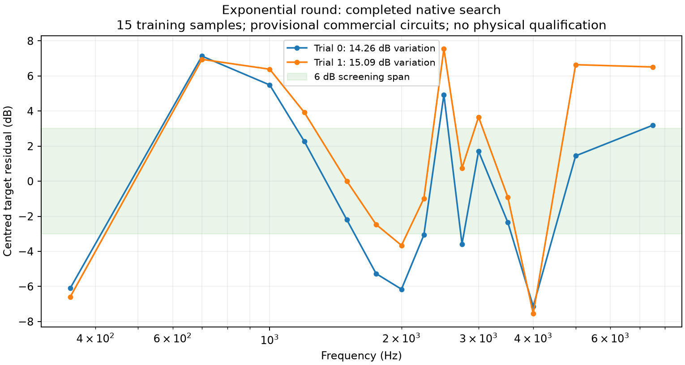
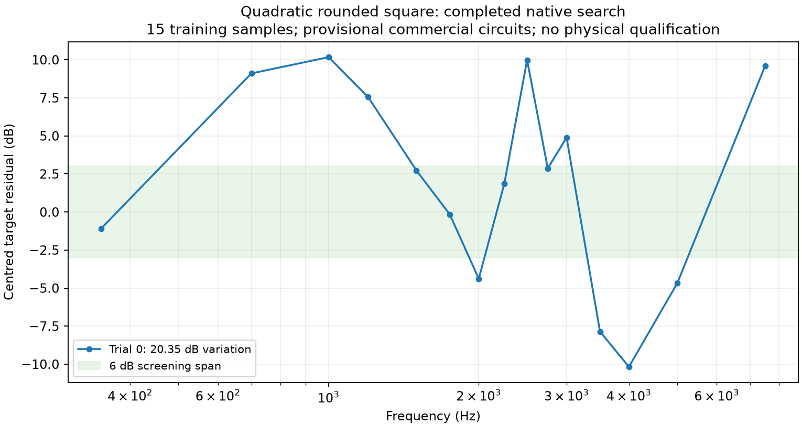

# Curved-flare commercial-circuit searches

The exponential-round starting shape now completes the full CAD → mesh → coupled
simulation → mutation → re-simulation → selection → export workflow. Both proposed
geometries completed all 15 frequencies. The mutation worsened response and
coverage, so the optimiser retained the seed. **Neither candidate passes the
unchanged 6 dB response-variation screen.**

| Candidate | Response variation | Coverage error | Combined objective | Planning cost |
| --- | ---: | ---: | ---: | ---: |
| Exponential seed | 14.2609 dB | 4.9657 dB | 17.1683 | £254.74 |
| Fitness-driven mutation | 15.0904 dB | 5.5997 dB | 18.3146 | £254.61 |

The mutation moved the entry from 60 mm to 55.4102 mm, reduced the port radius
from 19.0243 mm to 18.4696 mm, and changed the first section's diagonal profile
controls and the mouth's cardinal controls. These changes reached the CAD and
native meshes; they were not post-processing variations of a fixed acoustic field.
The unchanged selection objective includes response, coverage and cost.

The retained seed selects a 350 Hz mid high-pass, 4 kHz LR4 electrical crossover,
positive mid polarity, 0.15 ms HF delay and mid gain 0.4. Its sampled acoustic
mid/HF handover passes the declared 3–5 kHz screen, and its four parallel mids
have a minimum predicted impedance magnitude of 3.1262 Ω across the sampled
frequencies. These are predictions for the supplied source model. They do not
qualify a specific amplifier or establish output capability.

Both candidates use four reported FaitalPRO 4FE32-16 mid circuits and the
[provisional Peerless ideal-outlet model](research/commercial-hf-source-audit.md).
The physical compression driver, cone/phase-plug behaviour, purchased-driver
mounting geometry and printability remain unqualified. The quarter-turn vocal
search used a different HF model, so score differences from that earlier search
cannot be attributed to flare shape alone.

The predeclared study uses 350, 700, 1,000, 1,200, 1,500, 1,750, 2,000, 2,250,
2,500, 2,750, 3,000, 3,500, 4,000, 5,000 and 7,500 Hz, H/V polar cuts and 413
whole-sphere observations at 20 m. It retains the 2 Ω bank screen, £300 planning
budget, 6 dB response screen and 3–5 kHz acoustic handover. Complex64 exploration
does not pass the separate 1e-8 electrical qualification gate; no frequency
holdout, mesh convergence, far-field, measured-performance or physical release
claim is made. Two proposals are a bounded exploration, not a global optimum.

The [raw evidence and report](../validation/evidence/nonlinear-commercial-exponential-round/report.json)
contain both native evaluations, complete proposal ancestry, exact controls,
verified selected build bundle and a 1 V RMS operating report. The selected export
is an experimental output, not an accepted horn. Archive integrity, ancestral
replay, scores and exported geometry were checked against the actual inputs.

Native source is `5c5fab109c7ae169582d7330b157bf068c46ef0a`; post-processing uses
`852a5a33af9617ac3a40f9956ca12f744e3d0ba8`. The original field data are not relabelled
as runs of newer code.

## Completed quadratic rounded-square search

The second predeclared search is also complete. Its seed completed all 15 native
frequencies with 20.3480 dB response variation, 5.6783 dB coverage error and a
23.6141 combined objective. It fails the unchanged 6 dB response screen. Its
fitness-driven mutation failed the 32,000-triangle exterior workload limit before
native evaluation; that failure remains part of the search history.

The retained seed selects gain 0.8, a 350 Hz high-pass, 5 kHz LR4 crossover,
negative mid polarity and 0.75 ms HF delay. Its sampled acoustic handover passes
the 3–5 kHz screen, minimum predicted bank impedance is 3.1295 Ω, and its planning
cost is £256.17. Those individual checks do not make the horn acceptable.

The [quadratic report and raw archives](../validation/evidence/nonlinear-commercial-quadratic-rounded-square/report.json)
preserve the failed mutation, verified selection/export, 1 V RMS operating report
and source identities. Native and post-processing revisions are the same as the
exponential study. Neither starting family has produced an accepted design.
