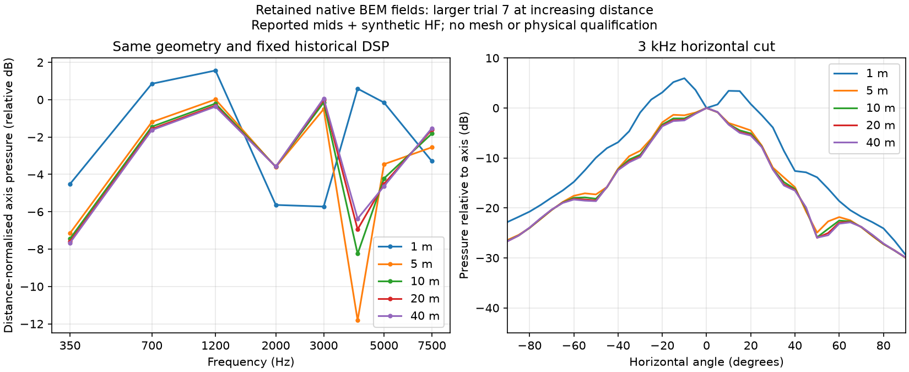

# Coverage at a declared distance

Optimisation can evaluate the horizontal and vertical cuts and the complete sphere
at a declared radius about the horn throat origin. Set
`acoustic_objectives.observation_distance_m` in the search brief, for example:

```json
"acoustic_objectives": {
  "observation_distance_m": 20.0,
  "sphere": {"angle_precision_deg": 10.0}
}
```

This is a finite-distance pressure calculation at 20 metres from `(0, 0, 0)`,
not a far-field transformation or a 1-metre sensitivity measurement. The same
radius applies to both polar cuts and the sphere. The value is recorded in the
compiled Boundary Lab project and checked against native observation coordinates
before scoring. Scoring, completed-search replay, recovery and finalist validation
retain the declared distance; a 1-metre result cannot be scored as a 20-metre run.
The geometry export contains the original brief and geometry; the solver project
remains in the original search evidence.

The default remains 1 metre. Default-valued objectives omit the new field in
serialisation to preserve historical control hashes. Existing experiments stay at
their original distance and do not become audience-distance predictions.

For compilation outside an optimisation, use
`meh compile-radiating ... --observation-distance-m 20`. The radius must
be positive and finite and must enclose the complete exterior mesh about the
throat origin. This conservative bound keeps all polar and spherical observation
points outside the model, including for asymmetric geometry.

Changing observation distance can change the relative response and directivity of
an extended source, so do not extrapolate these from 1 metre with an inverse-square
level correction alone. Keep the geometry and DSP fixed and compare calculations
at increasing radii before describing a result as far-field stable. Absolute
pressure remains dependent on the declared drive voltage and source model;
distance selection does not establish source calibration, maximum SPL, room or
outdoor propagation, or agreement with a physical loudspeaker.

## Executed evidence

Source `b13c176` completed a native FP64 search/replay/export case at 20 metres:
a synthetic freeform four-mid ring plus throat, four frequencies (350, 1,000,
2,000 and 3,000 Hz), both polar cuts and 413 sphere points. Its compiled project
matches the earlier 1-metre FP64 trial after changing only the distance; all six
mesh hashes match. Every frequency passed the unchanged `1e-8` electrical
consistency checks. The resulting 14.42 dB sampled response variation is not a
successful horn response. The diagnostic disables the 2-ohm constraint for its
synthetic circuits and does not qualify the user's target design.

A separate native projection used the retained BEM boundary pressure and normal
derivative of larger trial 7, with its historical DSP fixed, at 1, 5, 10, 20 and
40 metres. It did not remesh or rerun the coupled system. Reproduction at the
original 1 metre checked the projection against all 1,168 original complex H/V
samples, with no samples excluded by the declared relative-null floor of 0.001.

| Check | Result | Declared limit | Outcome |
| --- | ---: | ---: | --- |
| Original 1 m magnitude reproduction | 0.000107 dB | 0.05 dB | Pass |
| Original 1 m phase reproduction | 0.001028° | 0.5° | Pass |
| 20 versus 40 m axis magnitude, after multiplying pressure by radius | 0.570828 dB | 0.25 dB | Fail |
| 20 versus 40 m relative H/V pressure within ±45° | 0.884188 dB | 0.5 dB | Fail |

The stability checks cover all eight original frequencies from 350 to 7,500 Hz;
no coverage samples were excluded. These failed limits remain unchanged. The
largest 1-versus-40-metre relative coverage difference was 21.26 dB. This is
evidence against treating the old 1-metre coverage as distance-independent, not
a claim that any particular radius is sufficient for every horn.



The left plot multiplies pressure by radius and uses a common display reference
(the maximum at 20 metres), so simple spherical spreading does not hide changes
in response shape. The right plot normalises each horizontal cut to its own axis.
Neither plot refits the geometry or DSP. The large source experiment remains
unconverged, uses reported mid circuits plus synthetic HF, and its historical
3 kHz electrical crossover fails the later acoustic handover requirement.

The [evidence manifest](../validation/evidence/observation-distance/report.json)
indexes SHA-256/CRC-checked archives containing the complete 20-metre native trial,
search controls and export, distance-projection inputs/results and exact runners.
The original larger experiment is archived at commit
`e1696b3c963a44c6f36eb822adee71e99aef58ad`. Original solver source `a0a604e`,
projection application source `b13c176`, and pinned Boundary Lab revision
`8cb166226e412877d3f71f2845918e479b97aa85` are kept distinct.
