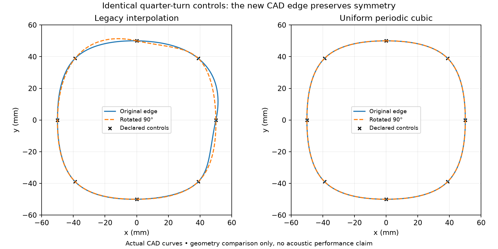

# Native evidence for periodic profiles and symmetry-preserving search

A two-candidate native experiment now exercises linked profile mutation,
versioned CAD interpolation, coupled FP64 simulation, selection and geometry
export. Both candidates pass the independently declared quarter-turn reference
and the unchanged 1e-8 electrical-consistency checks. The offspring is selected
because its numerical objective improves from 20.26879 to 19.97742.

This is a small synthetic integration case, not the target loudspeaker. Its
selected response variation is still 14.24975 dB on four diagnostic frequencies.
It establishes the workflow and a numerical symmetry reference, not commercial
source accuracy or a build-ready horn.

## CAD defect and versioned correction

Equal angular controls did not give the legacy interpolator a quarter-turn
symmetric surface. The kernel's periodic junction has only C1 continuity.
The actual legacy horn in the retained diagnostic extended to x = +51.34779 mm
and x = −50.00054 mm despite matching cardinal controls. Its entry locations were
also unequal under a 90° rotation.

The new `profile_interpolation: periodic_cubic` geometry option solves the cyclic
cubic interpolation system and uses a uniform periodic C2 B-spline. Every control
has the same treatment, including the seam. It also works for asymmetric
profiles; symmetry is an optional constraint on the controls, not an assumption
in the acoustic solver.

The failed CAD test is retained from frozen source `d0e3821`; the corrected
geometry and native workflow use `ab6714f`. The old and new diagnostic designs
match except for the explicit interpolation field. With the new interpolation,
the unported air, complete front air and exported horn material each coincide
with their 90° rotation: the checked boolean differences are valid and empty,
and none of the 400 sampled points per shape disagree. Invalid legacy boolean
cut volumes are preserved but **are not valid geometric error estimates**.

Existing design JSON without the new field continues to select `legacy`.
The default unconstrained evolutionary sequence and its serialised controls are
unchanged; an exact six-proposal fingerprint checks this. Changing interpolation
creates a new physical model and requires new meshes and simulation.

## Native run and independent limits

The small reference uses four identical synthetic mid drivers and one synthetic
throat driver, a 125 mm horn length, 50 mm nominal mouth radius, 20 m observation
radius, two 73-point polar cuts and a 413-point sphere. Its seed explicitly
averages the previous reference's cardinal and diagonal controls into separate
quarter-turn groups. The search then mutates linked groups and the common driver
axial offset while retaining geometric symmetry.

The solve uses pinned BoundaryLab
`8cb166226e412877d3f71f2845918e479b97aa85`, the packaged `coupled_reference` FP64
backend, two Julia threads and 350/1000/2000/3000 Hz. Both candidates are fresh
native solves. The historical reference's disabled 2-ohm screen remains explicitly
disabled for these synthetic circuits; this is not the practical amplifier case.

Before any native frequency arrays existed, the experiment declared a **2% maximum
relative complex error** for three independent rotation checks:

- Every excitation's horizontal/vertical pressure basis, with the source and
  observation coordinates rotated together.
- Each mid excitation's positive-axis pressure relative to their complex mean.
- The complete current and velocity matrices under the same driver permutation.

No relative-null samples are excluded. A zero reference must have zero difference.
These checks do not replace or relax the separate 1e-8 electrical gate.

| Maximum relative error | Seed | Selected offspring | Limit |
| --- | ---: | ---: | ---: |
| Polar pressure under quarter turn | 1.62551% | 0.561549% | 2% |
| Mid-axis equality | 1.13268% | 0.334318% | 2% |
| Current/velocity matrix rotation | 0.105159% | 0.0426481% | 2% |

Both pass. The maximum electrical reciprocity residual across both candidates is
4.92199e-9; the largest circuit voltage residual is 2.25321e-16. The unstructured
meshes are not exactly rotational copies; this is a numerical reference test,
not proof of mesh convergence or an acoustic accuracy bound for real drivers.

Search replay and the selected offspring's export both verify successfully. The
export retains its interpolation mode, source circuits, mutation and solver
provenance. The geometry remains an ideal driver interface with no qualified
commercial mounting, sealing or printing claim.

## Full-size diagnostic that motivated the change

This evidence also preserves the previous full-size candidate's complete
15-frequency projection to 20 m. The original 1 m pressure arrays are reproduced
with zero relative complex norm difference; float32 ratio roundoff is below
5.18e-7 dB and 1.36e-6 degrees over 41,925 samples, with eight display-comparison
samples excluded under the declared 0.001 relative-null floor. The original
DSP/score selection is replayed before reanalysis.

At 20 m, the fixed 1 m DSP gives 20.63024 dB variation; reselecting DSP gives
16.08300 dB. Both fail the unchanged 6 dB screen. At 3 kHz, the coherent sum of
four mid-excitation transfer columns is 8.59 dB below their magnitude sum; at
2 kHz the difference is only 0.25 dB. Each column includes mutually induced
motion. This algebraic decomposition does not uniquely isolate a diaphragm,
cavity or horn mode, and symmetry is not assumed to fix all of these dips.

## Preserved artifacts

[Report, exact source revisions and archive hashes](../validation/evidence/periodic-profile-symmetry/report.json)
include the failed and corrected CAD diagnostics, controls, exact runners, both
native trials, selected export, rotation checks, and the complete projected
full-size basis. The original dense-sweep native artifacts remain in the
[frequency-completion evidence](wide-vocal-completion.md). All archives passed
SHA/CRC checks and remain below the per-file repository limit.

Relevant verification: 718 non-CAD tests passed, both new CAD tests passed,
one bounded review found no material issue, and the native workflow and independent
checks passed. No physical measurement, qualified commercial source, held-out
frequency study, mesh-convergence result or print qualification is supplied by
this increment.
