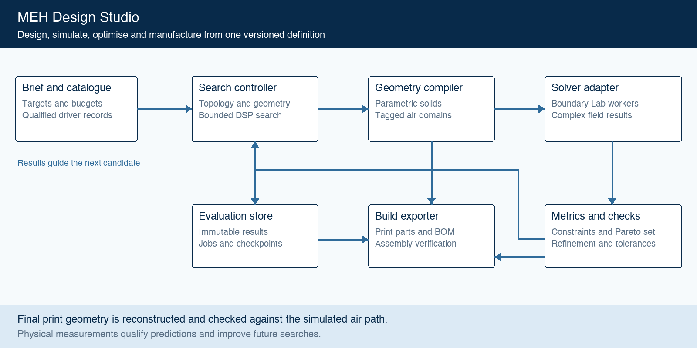

# MEH Design Studio

> Original PRD: 6 September 2026. Read alongside the [feasibility report](feasibility-report.md) and [validation strategy](validation-strategy.md), which refine the validation gates and mesh-resolution assumptions.

## 1 Executive recommendation

Build a desktop application that turns a budget, an acoustic target and an included driver catalogue into several manufacturable multiple entry horn designs. The application should select real drivers, vary their count and entry locations, generate the horn and enclosure, simulate the complete coupled system, and return a small set of verified trade-offs with printable parts and assembly information.

The recommended starting point is Boundary Lab, the software associated with JW Sound and Solana. Evaluate its solver through a versioned adapter, and build the product-specific catalogue, geometry generator, optimisation controller and manufacturing pipeline around it. Treat the first development phase as an integration and validation experiment before committing to a full product. Its documented capabilities make a new acoustic solver an unnecessary initial investment. [Boundary Lab repository](https://github.com/JWSound/boundary-lab).

The central architecture decision is to use several levels of simulation. Cheap models screen many candidates; coupled three-dimensional simulations evaluate promising geometries; tighter numerical checks and measurements qualify finalists. The optimisation must jointly consider horn geometry, driver selection, ports, rear chambers and crossover settings. Optimising an isolated horn surface would leave major determinants of the finished speaker unresolved.

This document defines a proposed product, not a completed implementation. All numerical acceptance limits, catalogue sizes, hardware envelopes and schedules below are proposed engineering targets to be calibrated during the feasibility phase. Research was checked on 6 September 2026. Software documentation was inspected, but no solver benchmarks or speaker measurements were performed for this report.

## 2 Product goals and scope

### Intended users and outcome

The primary user is a technically interested DIY builder who can assemble and measure a speaker but should not need to author acoustic boundary conditions. A secondary user is a loudspeaker engineer who needs editable geometry, source provenance and reproducible simulations. Both should be able to compare an inexpensive build with a more efficient or more accurate alternative.

“Hi-fi” means a stated response tolerance, consistent radiation through the crossover region, adequate clean output at the listening distance, and an explicit distortion measurement target. “Efficient” means acoustic output relative to real electrical input, alongside amplifier demand. “Cheap” means a declared bill of materials and manufacturing cost. None of these should collapse into an unexplained quality score.

### First release boundary

The first release shall support a straight, smooth common horn with a throat high-frequency source and either one symmetric pair or two symmetric pairs of side-entry mid/bass drivers. The catalogue, count and port positions remain optimisable within these families. Two-way active operation is the initial crossover mode. The design includes rear chambers and an optional separately specified subwoofer handoff.

The supported range of driver counts shall be visible before a search starts: for example, three or five physical drivers in the initial symmetric families. A user limit is an upper bound, not an instruction to use every available driver. A generic design schema shall support later odd counts, asymmetric layouts, more entry groups and three-way systems without changing driver identities or result semantics.

The first release shall output printable horn, mounting and enclosure parts for a declared printer profile. A hybrid printed horn and wooden enclosure may be an optional cost comparison, but it cannot replace the required printable design. Drivers, wiring, seals and fasteners are purchased components.

Arbitrary folded horn paths, free-form topology generation, custom diaphragm or motor design, passive crossover synthesis, room correction and nonlinear CFD are later capabilities. The initial horn “path” includes its length, area expansion, cross-section and transition curvature. Curved centreline and folded-path optimisation require additional geometry families and validation; they must not be implied by a straight-horn MVP.

### Example brief

This is an editable example, not a claim that these targets are jointly achievable: one speaker covering 150 Hz to 18 kHz; at most five drivers; driver spend at most 100 currency units; total assembly materials at most 200; 96 dB continuous target at 1 m under a specified test signal; 6 dB short-term headroom; and a 220 × 220 × 250 mm printer. Coverage might be 90° horizontal by 60° vertical above an explicitly chosen control frequency. The assembled enclosure can exceed one print bed because it is segmented.

The tool shall return “no feasible design found within this search budget” when appropriate, identify the active constraints, and offer quantified relaxations. It must distinguish that outcome from a proof of physical impossibility. Small size, low bass extension, controlled directivity, low price and high output can conflict; the interface should make the trade-off visible.

## 3 Research findings that shape the product

### The remembered software is Boundary Lab

JW Sound’s Solana page describes an emphasis on smooth directivity and driver integration, with additive manufacturing enabling complex waveguide geometry. The designer’s project thread describes the original Solana as a proof of concept for genetic-algorithm-driven waveguide design. These are strong precedents for the proposed workflow, but they do not establish that an arbitrary cheap-driver combination can achieve the same result. [JW Sound Solana](https://www.jwsound.live/designs/solana-diy); [designer project thread](https://www.diyaudio.com/community/threads/solana-project-thread.439795/).

Boundary Lab documents mesh generation/import, exterior boundary element simulation, interior finite element simulation, coupled electromechanical models, DSP controls and acoustic plots. A local/LAN solve server provides a promising automation boundary. These features need a pinned-version capability test rather than an assumption of a stable external API. [Boundary Lab repository](https://github.com/JWSound/boundary-lab); [server documentation](https://github.com/JWSound/boundary-lab/blob/main/docs/Boundary%20Lab%20Server.md).

### The horn and every entry form one acoustic system

The Danley and Skuran technical disclosure describes multiple frequency ranges entering a common horn at different positions, with drivers outside the main sound path. It links entry arrangements to acoustic loading and summation. Use that as a starting design principle, not a universal quarter-wavelength placement rule or an assurance of performance. [Sound reproduction employing unity summation aperture loudspeakers, 2002](https://patents.google.com/patent/US6411718B1/en).

An entry duct, the air space in front of a cone and the horn wall around the opening can introduce filtering and resonances. A useful optimisation therefore varies those features together with entry position. The electrical crossover can adjust level and timing, but it cannot make a poorly behaved spatial radiation pattern disappear at every angle. This is the engineering rationale for evaluating a listening region and full directional response.

### Optimising only the on-axis curve is insufficient

COMSOL’s horn optimisation example raises on-axis output while producing unwanted minima in other directions. Published horn optimisation research also demonstrates impedance-oriented shape optimisation with numerical and experimental validation. The relevant lesson is that objective selection determines the result: impedance matching, on-axis flatness and even coverage are related but distinct requirements. [COMSOL horn optimisation](https://www.comsol.com/model/optimizing-the-shape-of-a-horn-4353); [Xiao and colleagues, Applied Acoustics, 2023](https://www.sciencedirect.com/science/article/pii/S0003682X23004176).

### Model quality matters as much as the mesh

COMSOL distinguishes imposed diaphragm motion from a driver model that responds to acoustic loading. Its lumped-driver guidance also limits simple piston models to appropriate regimes and separates small-signal frequency-domain models from large-displacement nonlinear analysis. Consequently, a detailed mesh driven by inadequate source data can still produce misleading results. [COMSOL lumped driver modelling](https://www.comsol.com/support/learning-center/course/modeling-speaker-drivers-in-comsol-multiphysics-202/modeling-speaker-drivers-lumped-methods-88401).

## 4 Functional product requirements

Priority P0 is required for the first public release. P1 follows once the baseline is validated. Requirement IDs are stable references for implementation and testing.

| ID | Priority | Requirement and acceptance evidence |
| --- | --- | --- |
| PR01 | P0 | Accept target band, response tolerance, coverage, level, listening distance, maximum physical driver count, driver budget and total cost budget. Save and reload an identical brief with explicit units. |
| PR02 | P0 | Include an offline, rights-cleared driver pack. A fresh installation completes a reference search without importing a database or contacting a server. |
| PR03 | P0 | Search driver models, supported counts, entry positions and horn profiles. Demonstrate searches that select different counts and driver sizes under different constraints. |
| PR04 | P0 | Generate horn air geometry, printable solids, driver mountings and rear chambers automatically. Invalid or overlapping assemblies fail before solving. |
| PR05 | P0 | Simulate interacting drivers in the generated 3D geometry and retain complex responses, currents and motions. Pass the mutual-coupling fixture. |
| PR06 | P0 | Run a budgeted optimisation loop with pause, cancellation and restart. Resume a deliberately interrupted run without losing completed evaluations. |
| PR07 | P0 | Return comparable feasible trade-offs with cost, output, response, coverage, confidence and print statistics. Each displayed metric links to its evaluation. |
| PR08 | P0 | Optimise bounded active crossover, level and delay parameters; include required channels and electronics in cost accounting. Export an unambiguous configuration. |
| PR09 | P0 | Export unit-tagged 3MF parts, STL compatibility files, editable STEP geometry, assembly transforms, bill of materials and validation report. Check the final assembly against the simulated geometry. |
| PR10 | P0 | Import measured impedance and frequency response with measurement conditions. Overlay prediction and measurement without silently fitting away discrepancies. |
| PR11 | P0 | Explain missing driver data, infeasibility and numerical failures separately. Unknown distortion cannot be reported as a passing result. |
| PR12 | P1 | Add asymmetric counts, three-way systems, curved/folded path families, electrical-network optimisation and advanced loss models after dedicated validation. |

The interface shall follow five steps: set goals; inspect eligible drivers; run and watch the search; compare candidates; prepare a build. A cutaway view shall show diaphragms, front chambers, entry ducts and rear chambers with selectable names. It shall also show why a candidate was rejected and which dimensions can be locked for a subsequent search.

## 5 Recommended technical architecture

### Deployment and component boundaries

Use a local Python application with a desktop interface. First evaluate extending Boundary Lab’s desktop workflow so existing plots and model inspection remain useful. Keep all new domain logic independent of the UI and expose it through a headless command interface. Avoid a second web application and cloud orchestration layer until actual user needs justify them.

The proposed stack is Python for orchestration and numerical post-processing; CadQuery with OpenCascade for parametric solids; Gmsh for tagged analysis meshes; a Boundary Lab adapter for coupled solves; pymoo for the initial search; SQLite for local metadata; and immutable array/result files for large outputs. A later BoTorch service can prioritise expensive evaluations. These are implementation recommendations, subject to the first-phase packaging and licence audit.

Figure 1. One design definition produces both analysis geometry and printable parts. Results feed the search controller; final manufacturing changes feed back into verification.

| Component | Responsibility | Durable output | Failure behaviour |
| --- | --- | --- | --- |
| Brief and catalogue | Validate goals and qualify driver choices | Versioned brief and driver snapshot | Explain missing or conflicting inputs |
| Search controller | Propose topology, geometry and crossover candidates | Search state and evaluation queue | Checkpoint and respect remaining budget |
| Geometry compiler | Create solids, fluid domains and semantic tags | CAD and mesh manifests | Reject with geometry-specific reason |
| Solver adapter | Compile physical model and collect complex results | Raw results and diagnostics | Mark incomplete or numerical failure |
| Metrics and verification | Score comparable results and check finalists | Metrics, uncertainty and pass/fail evidence | Prevent unverified promotion |
| Manufacturing exporter | Split, orient and check parts; generate build pack | 3MF, STEP, STL and assembly manifest | Keep experimental exports clearly labelled |

### Build versus reuse

Reuse the acoustic engine, generic CAD kernel, mesher and optimisation algorithms. Build the MEH design grammar, catalogue qualification, source-model adapter, engineering metrics, scheduling rules and export checks. These are the parts that turn a simulation workbench into the product requested here.

Do not make mesh triangles the editable design. Store a compact parametric definition with named features. The same definition shall generate the fluid domains and the material around them. This prevents an attractive printable model from drifting away from the shape that was simulated.

Run geometry and solver tasks in worker processes so a crashed CAD operation or exhausted solver does not close the UI. Initially use one durable local queue and memory-aware scheduling. Remote computation is an optional worker destination, not a requirement for catalogue browsing, project editing or file export.

## 6 Acoustic simulation requirements

### Physical formulation

The proposed baseline is linear, frequency-domain pressure acoustics with rigid walls, coupled to each driver’s electrical and mechanical dynamics. Model bounded air inside the horn, ducts and relevant chambers with FEM; represent radiation into surrounding space with BEM. A selected simple exterior-only model can remain a screening option, but the release benchmark must include the actual MEH front chambers and entries.

For an electrodynamic source, voltage drives coil current, motor force drives diaphragm motion, and acoustic pressure loads that motion. Use a consistent phasor convention throughout. Store pressure as complex pascals, current as complex amperes, velocity as complex metres per second, frequency in hertz and observation coordinates in metres. Record whether amplitudes are RMS or peak at every external boundary.

All drivers remain present during every excitation case. A driver with zero applied voltage still has mechanical compliance and electrical damping; it must not become a rigid patch. Store the complete transfer matrices between electrical inputs and all measured outputs, including motion of other drivers. Validate series/parallel wiring through a circuit formulation or a rigorously restricted symmetric case; independent voltage sources do not automatically represent a series circuit.

### Critical driver adaptation rules

Boundary Lab’s physical-system documentation requires dry moving mass Mmd rather than the air-loaded Mms often found in catalogues. It derives projected diaphragm area from moving geometry and warns against duplicating a meshed rear chamber with an additional lumped compliance. The adapter must preserve these conventions. Never relabel Mms as Mmd or add both rear loads. Use a measured or justified conversion with provenance and uncertainty, otherwise limit the driver to screening. [Boundary Lab physical system model](https://github.com/JWSound/boundary-lab/blob/main/docs/Physical%20System%20Model.md).

For high-frequency sources, qualify an effective source model at the intended horn interface, including its loading behaviour and usable band. Ordinary free-field manufacturer frequency response is not an intrinsic diaphragm-velocity curve. Do not multiply it into the simulated horn and assume that baffle, radiation and horn loading have been correctly separated. If a suitable source model is unavailable, show the high-frequency result as provisional and require measurement. [COMSOL lumped driver modelling](https://www.comsol.com/support/learning-center/course/modeling-speaker-drivers-in-comsol-multiphysics-202/modeling-speaker-drivers-lumped-methods-88401).

### Solver maturity and scaling

The coupled-solver documentation describes first-order interior elements, a Burton–Miller exterior formulation, dense retained-system factorisation and single-precision production paths with a double-precision reference path. Some older passages conflict with newer backend descriptions. Require a pinned revision, runtime capability interrogation and executed regression fixtures before selecting a supported backend. Do not advertise fast-multipole scaling for this coupled path. [Boundary Lab coupled solver](https://github.com/JWSound/boundary-lab/blob/main/docs/Coupled%20Solver.md).

A GPU may accelerate a feasible system without making a very large system fit in memory. The scheduler shall measure peak memory and runtime against mesh size, frequency count and active source count. Its preflight shall reject or reschedule oversized jobs. A performance claim must identify the geometry, unknown count, hardware, precision, frequency grid and requested outputs.

### Mesh and numerical verification

Use separate meshes for manufacturing surfaces, bounded air volumes and exterior acoustic boundaries. Interface faces must connect with the orientations and continuity conditions required by the selected solver. Every active boundary needs an explicit role; the product compiler shall reject unclassified surfaces even if an upstream tool supplies defaults.

As an initial meshing heuristic, try characteristic element lengths no greater than wavelength/8 at the local upper frequency, with additional refinement for small ports and curvature. At 20 kHz and an assumed sound speed of 343 m/s, wavelength/8 is approximately 2.14 mm. This arithmetic illustrates the cost of broadband analysis; it is not an accuracy guarantee. Acceptance depends on refinement studies, including resonances and phase. Use different meshes by frequency band only with an overlap check.

Check energy accounting, interface continuity, geometric orientation and precision sensitivity. Use symmetry only when geometry, driver parameters, termination and excitation justify it. Re-evaluate selected finalists without symmetry, especially when testing manufacturing or driver mismatch.

### What the initial model can and cannot establish

The baseline can predict linear response, radiation pattern, impedance and excursion within qualified source-model bands. An excursion- or power-limited SPL curve is a modelled ceiling, not a measured maximum clean output. Do not infer THD, intermodulation, thermal compression, turbulence or cabinet panel radiation from a rigid-wall linear solve.

Narrow passages deserve particular attention: viscous and thermal boundary layers can matter, and general bulk damping is not a substitute. Research supports reduced boundary-layer treatments under stated geometric assumptions. Add calibrated duct-loss or boundary-impedance models first; reserve detailed thermoviscous FEM and nonlinear flow analysis for cases that justify the expense. [Berggren, Bernland and Noreland, 2018](https://arxiv.org/abs/1801.04177).

## 7 Optimisation design

### Search variables

Separate discrete architecture choices from bounded continuous shape parameters. Discrete variables include driver model IDs, physical counts, entry-group layout, supported wiring, chamber topology and horn family. Driver diameter is a consequence of selecting a catalogue part; the software must never scale a real driver to invent a purchasable size.

Continuous variables include horn length; cross-sectional dimensions at smooth axial stations; mouth aspect ratio and roundover; throat transition; entry distances and azimuths; duct area, length and flare; front and rear chamber volumes; and crossover frequencies, gains and delays. Initially limit a family to roughly 10–20 independent geometry variables. Fix manufacturing minimums and locked user dimensions before optimisation.

### Objective definition

Maintain a Pareto set: designs where improving one stated outcome requires worsening another. Initially optimise total build cost, acoustic response/directivity error and electrical power needed to deliver the target output. Treat enclosure size as a hard constraint or a separately selectable objective. Apply hard engineering constraints before ranking feasible designs.

For a target response, compute weighted RMS error in dB over logarithmically spaced frequencies and a defined listening window. Also constrain the worst departure so narrow notches cannot hide inside an average. Report the normalisation gain used, and measure actual power at the absolute target level. A flatter but much quieter candidate must not win through normalisation alone.

For directionality, compare frequency-dependent angular response with the user’s coverage envelope, inspect horizontal and vertical crossover lobes, and assess total radiated power on a weighted sphere. Use complex summation before converting to dB. Do not optimise only two polar slices if the shape is asymmetric. Any use of standard-derived spinorama metrics must state the implemented sampling and aggregation method.

Electrical input power shall be the sum of real V × conjugate(I) across input channels when RMS phasors are used. Electroacoustic efficiency is radiated acoustic power divided by real input power. On-axis 2.83 V sensitivity remains a separate metric because impedance, wiring and directivity affect it. Whole-system efficiency additionally includes amplifier losses when such a model is supplied.

For output headroom, scale the actual programme/filter combination until the first specified excursion, voltage, current or thermal constraint binds. Show the limiting driver and frequency. State the signal spectrum, crest factor and duration; a collection of single-frequency limits does not establish continuous broadband capability.

### Constraint and cost model

Hard constraints include maximum count; driver and total costs; assembled dimensions; qualified driver bands; excursion reserve; amplifier voltage/current/load limits; collision clearance; minimum wall and duct sizes; print envelope; and assembly access. Distortion targets remain measurement gates unless a validated level-dependent model is available.

Total cost shall include quantity-adjusted drivers, printed material and supports, hardware, seals, wiring and required crossover/amplifier hardware. Energy, failed-print allowance and labour are separately selectable cost terms. Record whether tax and shipping are included. Use a conservative estimate during screening and a slicer-derived material/time estimate for finalists. Missing prices cannot silently become zero.

### Staged search loop

| Stage | Proposed role | Advancement rule |
| --- | --- | --- |
| F0 | Catalogue filtering, packaging and reduced acoustic-network screening | Reject clear violations; retain diversity and uncertain candidates |
| F1 | Coarse 3D solves on a sparse adaptive frequency/angular grid | Promote promising candidates and a deliberate exploration sample |
| F2 | Coupled 3D model with qualified sources and denser sampling | Rank the candidate set on a common fidelity and metric definition |
| F3 | Mesh, frequency, angle and tolerance verification; final print geometry | Mark numerical verification only after all required checks pass |
| Physical | Build, measure and compare against predictions | Qualify the model/design and feed discrepancies into later searches |

F0 may use a segmented one-dimensional horn or lumped network to estimate loading and reject obvious cost/packaging failures. It must not claim reliable high-frequency directivity. Until screening correlations are demonstrated, avoid aggressive rejection on uncertain acoustic proxies. Track candidates mistakenly rejected by periodically checking a random sample at higher fidelity.

Use pymoo with mixed-variable operators and explicit multiobjective survival for the first search implementation. Its documentation supports categorical, integer and real variables, including multiobjective compositions. Do not assume that the default single-objective mixed-variable algorithm becomes multiobjective merely by returning more numbers. [pymoo mixed-variable documentation](https://pymoo.org/customization/mixed.html).

The controller shall generate candidates, validate geometry, reuse exact cache hits, run the selected fidelity, tune bounded DSP, calculate constraints and update the archive. It then selects further evaluations until the compute budget or stopping condition is reached. Checkpoint after every completed evaluation. Report search coverage and progress, never a guarantee of the global optimum.

For fixed physical geometry and driver termination, reuse complex source-basis results while varying ideal active DSP. Boundary Lab explicitly separates physical excitation from application-side gain, delay and filtering. Electrical networks or source-impedance changes require a new physical solution or a validated multiport calculation. [Boundary Lab physical system model](https://github.com/JWSound/boundary-lab/blob/main/docs/Physical%20System%20Model.md).

Add Bayesian selection only after collecting paired low/high-fidelity data. BoTorch offers mixed-variable and multifidelity model classes, but combining changing topology, fidelity, constraints and several objectives remains custom development. Start with separate models by topology family and explicit uncertainty calibration. Keep surrogate predictions out of the final verified leaderboard. [BoTorch model documentation](https://botorch.org/docs/models).

The final verification uses extra frequency and angular samples not used for optimisation, particularly around resonance peaks, response dips and crossover transitions. Report best-case and conservative performance under declared driver and print tolerances. If uncertainty distributions are not measured, describe the results as scenario ranges rather than probabilistic confidence intervals.

## 8 Geometry and printable output

### Parametric design grammar

Define the main horn by axial stations and smooth cross-sections, with positive area, controlled curvature and fixed connection semantics. Each entry group references an axial coordinate, angular arrangement, duct shape, front chamber and driver transform. Rear volumes, vents and access panels are separate named features. A later curved horn uses centreline arc length and local coordinate frames rather than treating axial distance as acoustic path length.

Generate mounting faces from verified driver dimensions, including basket, bolt circle, magnet depth, terminal clearance and cone/surround travel. Impose a swept-volume clearance over the declared excursion range. Show a cutaway collision report and require tool access for screws, wiring and driver replacement.

CadQuery is a suitable code-driven solid-modelling starting point, with STEP and mesh export options. Preserve the original parametric definition because a STEP or STL export alone does not retain the full editable design logic. Gmsh provides programmable meshing and physical groups needed by the analysis pipeline. [CadQuery documentation](https://cadquery.readthedocs.io/en/stable/index.html); [CadQuery export documentation](https://github.com/CadQuery/cadquery/blob/master/doc/importexport.rst); [Gmsh](https://gmsh.info/).

### Manufacturing pipeline

The printer profile shall specify bed dimensions, material/process, nozzle or feature capability, dimensional allowance, layer height, support policy and cost assumptions. Overhang limits are profile-dependent. Segment the model into printable orientations, add alignment features and seals, and keep supports removable from every internal duct. For resin, include drainage and cleaning access as applicable. Orientation and splitting affect manufacturability and surface finish. [Prusa design guidance](https://help.prusa3d.com/article/modeling-with-3d-printing-in-mind_164135?product=core-one-plus).

Use 3MF as the primary mesh container because it carries units and multiple objects. Export one STL per part for compatibility, with an explicit millimetre convention in the manifest. Export STEP for subsequent CAD work. A mesh-container specification does not prove a real print is airtight or mechanically suitable. [3MF specification](https://3mf.io/spec/); [Prusa multiple-object handling](https://help.prusa3d.com/article/split-to-objects-parts_1751).

The printable parts must represent closed material volumes even though the assembled speaker has an open horn mouth and intentional ducts. Check manifoldness, self-intersection, orientation, positive volume, minimum thickness, disconnected fragments, hole dimensions and fit within the actual build volume after orientation, support and brim allowances.

After segmentation, reconstruct the nominal assembled air geometry and compare it against the analysed geometry. Any port-area, chamber-volume or acoustic-surface change beyond the declared tolerance invalidates the previous verification. Rerun finalist analysis when needed. Include seam leakage and dimensional perturbations as sensitivity scenarios.

Printed wall stiffness, joints and sealing require physical checks. Prusa’s watertight-print guidance illustrates that apparently solid plastic prints can leak. The product shall require a seal test and mounting fit check for its reference builds, and a panel-resonance check before claiming rigid-wall predictions represent the finished speaker. [Prusa watertight-print guidance](https://help.prusa3d.com/article/watertight-prints_112324?product=mk3s-2).

### Build package

Every verified export shall contain numbered 3MF parts, compatibility STLs, STEP assembly, assembly transforms, exploded-view instructions, driver and hardware BOM, sealing guidance, crossover settings, recommended print profiles and a simulation report. Include the exact brief, driver revisions, geometry revision, solver version, validation status and file hashes. The report shall explicitly distinguish predicted, numerically verified and physically measured performance.

## 9 Included driver database

### Scope and provenance

Ship a modest curated catalogue, not an empty importer. Proposed first-release acceptance is at least 30 real driver models spanning three useful price/size classes, with at least six complete qualified source records sufficient to support two demonstrable MEH families. The count is secondary to usable data, affordable availability and documented redistribution permission. If permissions or qualification are missing, the release gate remains unmet.

Manufacturer sources can be rich: Dayton’s ND91-4 page provides specification, response/data, Klippel and scan downloads. Availability of a download is not evidence of permission to redistribute it in another product. Treat public aggregators as discovery resources until their data terms are resolved. [Dayton ND91-4](https://www.daytonaudio.com/product/1046/nd91-4-3-1-2-aluminum-cone-full-range-driver-4-ohm); [Loudspeaker Database about page](https://loudspeakerdatabase.com/about).

The initial curation workflow is manufacturer agreement or another documented permitted source, automated validation, manual review, and versioned publication. Independently collected measurements are a second route where permitted. Allow private user imports and overrides, but keep them separate from the redistributable pack. Do not distribute manufacturer curves, scans or photographs without an applicable permission record.

| Record group | Required information |
| --- | --- |
| Identity | Manufacturer, model, variant, revision, driver type, nominal size and status |
| Small-signal model | Re, inductance model, Fs, Q values, Sd, Bl, Cms, Rms, Mms and Mmd distinguished, derivation method and valid band |
| Limits | Xmax with definition, mechanical clearance, power test conditions, thermal/nonlinear evidence when available |
| Geometry | Cutout, mounting pattern, overall dimensions, depth, diaphragm shape and protected travel envelope |
| Measurements | Complex response/impedance, units, distance, voltage, reference timing, baffle/horn, angle, environment and calibration |
| Offers | Supplier, currency, region, quantity, stock, tax/shipping scope, observed time and expiry policy |
| Provenance | Source URL/hash/date, reported or measured or derived status, uncertainty, licence/permission and reviewer |

Retain reported and derived values independently. Flag inconsistencies such as displacement volume disagreeing with Sd × Xmax or dimensions differing between a sheet and a scan. Never silently choose the value most favourable to optimisation. A geometry conflict prevents verified export until resolved.

### Capability levels

Screening records support feasibility estimates from scalar parameters and dimensions. Linear-qualified records add a source model validated over a stated frequency band and mounting context. Level-qualified records add measured nonlinear/thermal evidence under specified conditions. These are capability labels, not a single quality percentage.

A driver may be qualified for midrange use but not for the full requested band. Preserve that distinction when selecting crossovers. Missing phase, dry mass or reliable geometry must produce a specific remediation request rather than a plausible-looking synthetic value.

Store the included pack as a read-only versioned SQLite database and the user’s additions in a separate writable database. Acoustic revisions are immutable. Offers can refresh independently, but a running optimisation uses a price snapshot. Recheck price and availability when preparing a purchase list, and show any budget change without silently changing the validated driver.

## 10 Data contracts and evaluation lifecycle

### Proposed contracts

| Contract | Essential fields | Invariant |
| --- | --- | --- |
| DesignBrief | Units, target curves/bands, coverage, level/signal, budgets, count, envelope, printer, locked values | Complete normalised input; no hidden defaults |
| DriverRevision | Stable ID, provenance, parameters, assets, capability/validity and uncertainty | Immutable after publication |
| Candidate | Parent, topology, catalogue IDs, geometry parameters, circuit and DSP | Physical count and cost reproducible |
| GeometryManifest | Feature IDs, transforms, solids, volumes, boundary tags, mesh settings | Analysis and print assets share one origin |
| EvaluationSpec | Candidate hash, fidelity, frequencies/angles, medium, solver version and precision | Fully defines the numerical request |
| EvaluationResult | Status, complex arrays, units, diagnostics, timings, metrics and reasons | Partial or failed data cannot masquerade as complete |
| BuildManifest | Part hashes, assembly transforms, BOM, configuration and verification links | Export traceable to verified candidate |

The application service shall offer versioned operations equivalent to validate_brief, list_eligible_drivers, generate_candidate, evaluate, start_search, pause_search, cancel_search and export_build. These are proposed product interfaces, not claims about existing Boundary Lab endpoints. The solver adapter is responsible for translating them to the pinned upstream protocol.

Store large arrays in an explicitly versioned HDF5 or equivalent array format with dimensions such as frequency × excitation × observation. Retain real and imaginary components and coordinate arrays. A CSV magnitude curve is an export view, not the authoritative simulation record.

### State, caching and recovery

An evaluation moves through queued, geometry-validating, meshing, solving, scoring and completed. Terminal alternatives include infeasible, invalid-input, numerical-failure, resource-limit and cancelled. A candidate that violates a valid engineering constraint is different from a solver that fails to evaluate it.

A cache key shall include canonical geometry, driver/source revisions, electrical termination, mesh settings, medium, frequency/observation specification, solver build and precision. Keep DSP synthesis and price scoring in separate dependency layers so those changes do not unnecessarily remesh a horn. Invalidate derived results whenever their actual dependencies change.

Write outputs into a temporary evaluation directory and publish a completed manifest atomically after all required files and checks exist. SQLite metadata shall reference only complete immutable results. On restart, orphaned or interrupted jobs become resumable or explicitly failed. Retrying a job must not create duplicate “best designs” or double-count its compute spend.

Record random seeds, algorithm configuration and optimiser checkpoints. Numerical reproducibility means results agree within a declared tolerance on a supported environment; it does not require bitwise identity across GPU vendors. Preserve raw outputs so changed metric definitions can be recomputed without rerunning acoustics.

## 11 Validation and release acceptance

### Numerical fixtures

The test suite shall progress from analytical or independently calculable cases to measured speakers. Include a baffled piston, simple duct/cavity modes, a conical horn, a driver with a sealed rear volume, a vented enclosure, and two sources with mutual loading. For each fixture, test units, phase/sign convention, impedance and response as applicable. Compare a representative horn against an independent solver where available.

Proposed initial numerical targets are below. Near true response nulls, use complex-pressure error normalised to a stable reference rather than an unbounded relative dB/phase error. Numerical convergence is necessary but does not establish that the physical model is accurate.

| Test | Proposed acceptance target |
| --- | --- |
| Simple analytical fixtures | Resonance frequencies within 1%; magnitude within 0.5 dB and phase within 5° in applicable non-null regions |
| Mesh refinement | Finalist response changes under 0.5 dB and beamwidth under 5° where defined; resonance frequencies shift under 1% |
| Backend comparison | FP32 and reference FP64 satisfy fixture tolerances; failures require a qualified precision/backend policy |
| Coupling and energy | Reciprocal test cases and input/radiated/dissipated power balance within a declared 1% target for suitable fixtures |
| Geometry generation | At least 95% success on a predeclared valid parameter sample; 100% of known invalid cases rejected |
| Print export | Every release fixture imports at correct scale into two selected slicers with no repair; parts fit and assemble |
| Recovery | Forced interruption at every job stage preserves completed results and prevents false completion |

### Physical reference programme

Build at least two topology families and two samples of each, including one using the least expensive qualified drivers. Measure each driver’s impedance before installation, record as-built dimensions, and measure the completed system’s impedance, axial/listening-window response and horizontal/vertical polars. For full directional qualification, collect sufficient spherical data rather than extrapolating two slices.

Use a documented low-reflection measurement arrangement. State microphone calibration, distance, angular reference, drive voltage, window length and environmental conditions. Use near-field or ground-plane methods for low frequencies when appropriate, with a documented splice and validity range. Do not score room reflections or a too-short time window as modelling failure.

Proposed physical targets are a 1/12-octave response mean absolute error at most 2 dB across the validated band, with 95% of applicable bins within 3 dB; major impedance resonances within 5%; and beamwidth within 10° where the pattern has an unambiguous crossing. These targets apply after one declared level calibration, not unrestricted EQ fitting. Investigate local deviations even if the aggregate passes.

For hi-fi qualification, measure THD, intermodulation where practical, output compression, noise and rattles at stated listening and stress levels. An initial illustrative THD target is below 3% over the specified working band at the design listening level, subject to product-definition review. Pass/fail must disclose measurement noise floor and test conditions; low measured THD alone is not a complete sound-quality assessment.

The optimisation itself needs a baseline: on three saved design briefs, compare the system with a hand-tuned seed under the same compute budget. Require a reproducible Pareto improvement without violating constraints, and repeat with at least three random seeds. Publish both wins and failed briefs. A cost reduction target such as 10% is a programme goal to test, not a forecast.

## 12 Operational and licensing requirements

### Performance and reliability

Target a CPU-only reference configuration with 32 GB RAM and an optional accelerated workstation with 64 GB RAM and 16 GB GPU memory. These are proposed test envelopes, not proven minimum specifications. Keep one modest coupled reference model usable on CPU. Test macOS and Windows explicitly before claiming desktop support; a backend supporting ARM is not equivalent to a packaged Mac application.

The first performance study shall measure CAD time, meshing time, solve time, memory, result size and finalist verification cost separately. Use those measurements to predict a run before starting it. An illustrative early search might screen 1,000 candidates, perform 100 coarse solves and verify five finalists, but the user’s compute ceiling determines actual counts. Do not promise an overnight search until this workload is benchmarked.

The interface should respond to cancellation within two seconds and stop scheduling new work immediately; terminate or finish the active frequency safely according to backend capability. Set per-job memory/time limits, retain diagnostic reasons, and permit at most one automatic retry for a transient worker failure. Do not silently replace a failed precise solve with a coarse result.

### Local and optional remote execution

Keep projects and private driver measurements local by default. Validate imported archive paths, units and file sizes; treat imported project data as data rather than executable CAD scripts. Only run trusted built-in geometry generators automatically. Remote workers need explicit connection setup, authenticated transport, job isolation, storage limits and deletion controls. Do not expose an unauthenticated solve server directly to the internet.

### Distribution decision

Boundary Lab is GPL-3.0 licensed. The recommended product direction is a GPL-compatible open application with explicit component attribution and a separately licensed driver-data pack. Its bundled ATH permission should be reviewed separately before redistributing that component; a new CadQuery geometry provider can reduce dependence on it. [Boundary Lab licence](https://github.com/JWSound/boundary-lab/blob/main/LICENSE); [Boundary Lab repository](https://github.com/JWSound/boundary-lab).

Gmsh documents GPL distribution and a commercial licensing route for closed-source integration. CadQuery identifies Apache-2.0 for its own code, while its CAD kernel and packaged dependencies require their own inventory. If a proprietary product is required, settle the distribution model before implementing tight integration. A subprocess boundary is not by itself a resolution of licence obligations. [Gmsh licensing](https://gmsh.info/); [CadQuery repository](https://github.com/cadquery/cadquery).

The software licence, driver-data permissions and rights to any imported speaker designs are separate decisions. Public DIY plans are useful references; copying their geometry into a bundled design library requires compatible permission. This report does not establish commercial clearance for a particular speaker design.

## 13 Alternatives considered

| Option | Main advantage | Decision |
| --- | --- | --- |
| Boundary Lab integration | Existing loudspeaker workflow and coupled models | Preferred feasibility path; pin and validate before commitment |
| AKABAK integration | Domain-specific BEM and lumped-element modelling | Independent verification/export option; batch API and distribution terms need confirmation |
| COMSOL implementation | Advanced multiphysics and demonstrated horn optimisation | Strong engineering reference; require a licence/automation proposal before making it a product dependency |
| New solver on Bempp or FEM libraries | Greater control over algorithms and scaling | Fallback if measured requirements exceed existing engine; much larger validation burden |
| Reduced horn model only | Very cheap screening | Retain at F0; insufficient for final MEH directional verification |
| Unrestricted mesh or AI shape generation | Very broad geometry exploration | Defer; validity, source attribution and manufacturability become harder to control |

AKABAK’s official description supports its role as a combined acoustic/lumped-element tool. COMSOL’s examples establish relevant optimisation capability. Bempp supplies acoustic boundary-element building blocks rather than a complete inverse-design product. No recommendation here assumes unattended embedding or redistribution rights for commercial tools. [AKABAK](https://www.randteam.de/AKABAK3/Index.html); [COMSOL horn optimisation](https://www.comsol.com/model/optimizing-the-shape-of-a-horn-4353); [Bempp](https://bempp.com/).

## 14 Development roadmap and decision gates

The critical path is qualified source data plus reproducible geometry-to-solver automation. The first milestone should prove those two things on a real MEH before investing heavily in catalogue breadth or interface polish.

| Phase | Planning estimate | Deliverable and exit gate |
| --- | --- | --- |
| A Feasibility | 3–4 weeks | Pin solver; audit distribution; qualify one driver set; generate and solve one complete MEH headlessly; measure scaling and compare one physical baseline |
| B Reproducible vertical slice | 6–8 weeks | Brief → catalogue → CAD → coupled solve → metrics → printable assembly; pass elementary physics, geometry and restart fixtures |
| C Search and catalogue | 6–8 weeks | Mixed-variable Pareto search, DSP reuse, offline pack, cost model and user comparison; show improvement over saved baselines |
| D Print and measurement beta | 6–8 weeks | Two physical families, repeated builds, slicer/assembly verification, uncertainty reporting and corrected model discrepancies |
| E Public release | 3–4 weeks | Supported installers, pinned dependencies, data permissions, documentation and all P0 gates passed |

These are planning estimates for a small experienced team, roughly six to eight months in total if phases proceed largely sequentially. They are not vendor quotes or measured engineering throughput. Plan around three core contributors: an acoustics/numerics engineer, a CAD/manufacturing engineer and an application/optimisation engineer, with part-time measurement and release support. A solo implementation will need narrower scope or a longer schedule.

At the end of Phase A, proceed only if driver adaptation, interface meshing, batch execution and a representative accuracy comparison work within the chosen compute envelope. If they do not, narrow the validated band/family, improve source measurements or reassess the solver. Preserve failed benchmark evidence rather than weakening release criteria after seeing the result.

Later work can add calibrated Bayesian promotion, advanced port losses, passive circuit optimisation, structural panels, curved paths, more driver families and distributed workers. Each expansion must have its own representative measured fixture and update the confidence model.

## 15 Decisions to settle before implementation

The proposed defaults are an open desktop product, active two-way operation, straight horn families, printable segmented enclosures and a small curated catalogue. Confirm the intended distribution model, first target market/currency, printer process and maximum assembled size, first listening-level/bandwidth brief, and whether amplification is purchased or already owned.

The main unresolved technical risks are source-model data for inexpensive high-frequency drivers; the cost of full-band coupled solves; manufacturing leakage and wall motion; and how well reduced models preserve candidate ranking. Each has an assigned feasibility or physical-validation gate above. A polished interface cannot compensate for failure in these areas.

The recommended first build is one reproducible, measured MEH design driven through the entire software pipeline. Once that works, extend the number of catalogue choices and geometry variables. The product succeeds when a user can print and assemble a design whose measured behaviour supports its predicted trade-offs.
