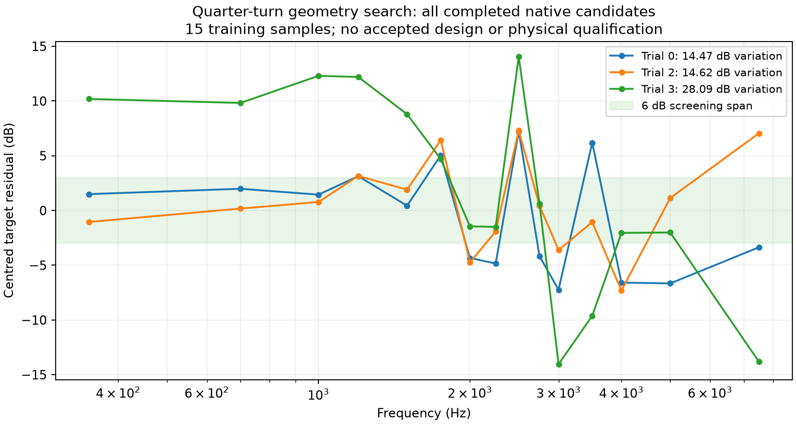

# Completed quarter-turn vocal-band search

The four-proposal search completed with three coupled native evaluations and
one preserved exterior-mesh failure. **None meets the 6 dB response-variation
screen.** Trial 2 has the best combined objective because its coverage score
improves; its axial response is slightly less flat than the baseline.

The experiment uses frozen application commit `ab6714f`, four reported
FaitalPRO 4FE32 16-ohm circuits and the original synthetic HF source. Each
evaluated candidate has fresh generated geometry, meshes and a complete
five-source FEM/BEM solution at 15 frequencies from 350 to 7,500 Hz. Four
parallel mids feed the same horn as the throat source. Whole-sphere and H/V
observations are at 20 m; this distance is not a far-field qualification.

## Search and outcome

The periodic cubic profile links cardinal controls and diagonal controls to
preserve quarter-turn symmetry while allowing noncircular sections. The declared
baseline is followed by two fitness-driven mutations and one scheduled random
exploration. The failed first mutation remains part of the proposal history;
trial 2 therefore uses trial 0 as its parent.

| Trial | Proposal | Response variation (dB) | Coverage error (dB) | Combined objective |
| ---: | --- | ---: | ---: | ---: |
| 0 | Declared baseline | 14.468 | 7.093 | 18.450 |
| 1 | Mutation of 0 | — | — | Exterior triangle cap exceeded |
| 2 | Mutation of 0 | 14.623 | 6.057 | 18.086 |
| 3 | Random exploration | 28.085 | 7.508 | 32.273 |

Coverage error is the existing average of H/V and whole-sphere target errors.
The combined objective includes response, weighted coverage and the declared
cost term. The 6 dB screen applies to response variation after accounting for
the intended 350 Hz LR4 high-pass roll-off.

Trial 2 changes the nominal entry position from 60 to 59.727 mm, port radius
from 19.024 to 16.544 mm, port-length control from 6 to 7.279 mm, and the first
profile station's diagonal radius scale from 0.9793 to 0.9093. Its selected DSP
uses mid gain 0.1, inverted mid polarity, 5 kHz LR4 crossover and zero HF delay.
The sampled acoustic handover screen passes. Its parallel-bank minimum
impedance is 3.137 ohms, and its planning cost estimate is £261.15 against £300.
These results do not establish amplifier compatibility or real driver fit.

## Diagnostics and next design direction

The baseline's retained internal and mouth fields show strongly nonuniform
pressure around the vocal-band dip. At 3 kHz, the magnitude of the mouth's
area-mean pressure divided by its spatial RMS is 0.158; the corresponding
normal-derivative ratio is 0.092. Both ratios are substantially larger at the
neighbouring 2.5 and 3.5 kHz samples. These spatial diagnostics are not radiation
efficiency, a substitute for the full exterior calculation, or proof of a single
geometric cause.

A separate retrospective diagnostic fits three common digital peaking filters
to trial 2's existing training samples, using the
[W3C peaking-filter formulation](https://www.w3.org/TR/audio-eq-cookbook/).
Positive gains sum to at most 6 dB and cut magnitudes to at most 6 dB; centre
frequencies are confined to the target band and Q to 0.5–4. The finite search
reduces training variation to **10.817 dB**, still above the 6 dB target. It
reaches its generation budget without convergence. The fitted transfer requires
up to 1.831 times the voltage, with no qualified headroom or held-out response
test. A common filter cannot improve angular pressure ratios or the relative
mid/HF handover. It is not a hardware preset or a replacement search result.

The next native experiments start from the separately prepared
[exponential-round and quadratic rounded-square flares](curved-mouth-preparation.md),
using the provisional commercial HF circuit. This completed search supports
continuing the geometry work; it supplies no accepted target horn.

## Reproduction and limits

The [evidence report](../validation/evidence/quarter-turn-vocal-search/report.json)
binds the complete search, failed trial, ancestry, raw fields, diagnostics,
selected geometry export and 1 V operating report. Postprocessing uses frozen
commit `c217b86`; the native source identity remains `ab6714f`. Candidate replay
checks the saved proposals and independently recomputes completed scores before
export. The original search is not rewritten by either diagnostic.

The export is an experimental selected candidate, not an approved build.
Strict electrical qualification, held-out frequency performance, full-size mesh
convergence, calibrated commercial source behaviour, real cone/basket/motor
clearances, printing and physical measurements remain unresolved. The synthetic
HF source is retained explicitly in this historical result.
