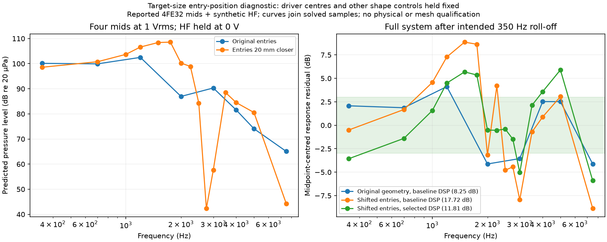

# Target-size entry-position experiment

Moving the four entry ports 20 mm toward the throat, while holding their driver
centres fixed, worsened this candidate. The completed coupled simulation predicts
deep mid-bank nulls near 2.75–3 kHz. None of the 252 tested DSP combinations meets
the declared 3–5 kHz acoustic handover window. This configuration is not a
successful wide-vocal design.

The reference is **trial 0**, not winner trial 7, from the
[larger search](larger-target-experiment.md). Its four driver centres remain at
60 mm along the horn; ports move from 60 to 40 mm, using a +20 mm driver offset.
All other geometry controls are identical. The sources remain four reported
FaitalPRO 4FE32 16-ohm circuits and an explicitly synthetic HF circuit.

The new native run solves 350, 700, 1,000, 1,200, 1,500, 1,750, 2,000, 2,250,
2,500, 2,750, 3,000, 3,500, 4,000, 5,000 and 7,500 Hz, including 413 sphere
observations. This denser diagnostic grid is not an independent holdout. Both
geometries use unconverged meshes; differences cannot be attributed exclusively
to geometry with an established numerical error bound.

| Comparison | Target-relative response range |
|---|---:|
| Original baseline, original DSP, eight original frequencies | 8.2486 dB |
| Shifted ports, same DSP, same eight frequencies | 16.1427 dB |
| Shifted ports, same DSP, all fifteen frequencies | 17.7241 dB |
| Shifted ports, reselected DSP, all fifteen frequencies | 11.8064 dB |

The frozen baseline DSP has mid gain 0.2, 350 Hz high-pass, 3 kHz crossover,
positive mid polarity and 0.75 ms HF delay. Reselection chooses gain 0.1 and
0.45 ms delay, retaining the filters/polarity. That score remains above the
6 dB provisional response screen. Changing DSP does not rescue the wide-vocal
requirement: the selected mid-bank pressure is below the HF-channel contribution
at 2.25, 2.5, 2.75 and 3 kHz.

The left plot holds every mid at 1 Vrms and HF at 0 V. It includes all mutually
induced motion; it is not a decomposition into independent diaphragm powers.
The right plot removes the intended 350 Hz high-pass target and centres the
residual range. Lines join solved samples, not measured continuous responses.

The [evidence report](../validation/evidence/target-eccentric-entry/report.json)
preserves the native result, source/runtime identity, frozen-DSP comparison,
separate handover-constrained reanalysis, export verification and archive hashes.
Native evaluation and the comparison use application source `1187c25`; the new
handover constraint, export and operating report use `e1a7a42`. The latter reuse
the unchanged native voltage bases. All six archives passed SHA256/ZIP CRC checks.
The exported research bundle retains the original search's selected DSP; it is
not relabelled as a handover-qualified design.

This rejects one tested configuration, not every independent-entry geometry.
The longer centre-line ducts previously identified by CAD inspection remain a
useful design variable, but this experiment does not prove the mechanism of the
nulls. Strict electrical validation still fails for native complex64 storage;
mesh convergence, commercial HF/source geometry, physical measurement and print
qualification remain open. The [commercial HF audit](research/commercial-hf-source-audit.md)
records a data lead without substituting it into these predictions.
