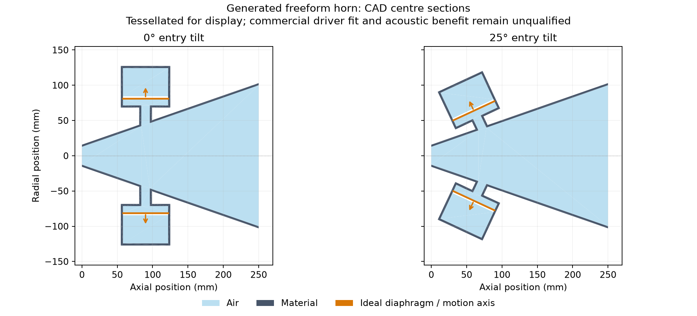

# Tilted mid-driver entries

`HornGeometry.driver_tilt_deg` permits a common entry tilt between 0 and 60 degrees.
Positive tilt turns each outward driver axis toward the throat: the x-positive
driver's axis becomes `(cos(angle), 0, -sin(angle))`. A four-driver ring rotates
this axis around the horn, preserving its common axial component and source IDs.

The angle changes the port, front chamber, diaphragm plane, rear cavity, material
parts and rigid exterior envelope. Meshing uses the resulting CAD, and the physical
driver components receive the same tilted motion axes. The original axial entry
coordinate is the tilted port centreline's intersection with the horn's main axis;
it is not the driver centre or the port's wall-intersection coordinate.

To keep a front chamber outside a curved flare, the generator clips the unported
horn air to the chamber's circular envelope and finds the furthest extent along
the tilted axis. The declared wall and duct lengths then locate the chamber beyond
that extent. Exact CAD checks still reject intersecting parts, disconnected air,
missing chamber back walls and front chambers crossing the throat or mouth plane.
This permits shorter passages in some steep flares; it does not guarantee a shorter
passage or a better acoustic result for every angle.

Zero tilt is omitted from serialized geometry, preserving existing radial design
identities and seeded searches. A tilted driver currently requires zero
`driver_axial_offset_m`; combining an eccentric port with a tilted driver is rejected.
Searches can add a gene such as:

```json
"geometry_bounds": {
  "driver_tilt_deg": [0.0, 40.0]
}
```

Angles are recorded in candidate geometry and mutation parentage and replayed from
the declared seed and fitness history. Other geometry constraints still apply, so
some proposed angles will be rejected during validation or CAD construction.

The [tilted ring example](../examples/tilted-ring-geometry.json) uses ideal circular
driver interfaces. Tilting does not supply commercial cone/basket/motor geometry,
bolt interfaces, an HF mounting package or print qualification. Rear cups can extend
toward the throat; clearance to an actual HF driver and its wiring remains a separate
mechanical requirement. Acoustic benefit requires a completed coupled simulation
and the existing numerical/response checks.

## Completed native integration experiment



These sections show the baseline's physical CAD with zero and 25-degree tilt;
they are not measured acoustic results or a comparison of the selected mutation.
A separate two-candidate FP64 experiment now completes the CAD, meshing, native
five-driver solve, fitness mutation, ancestral replay and selected build export.
It uses synthetic reference circuits at 350, 1,000, 2,000 and 3,000 Hz, with H/V
polars and 413 spherical observations at 20 m. Its original reference DSP and
disabled 2-ohm screen are retained; commercial-target requirements are unchanged.

| Candidate | Tilt | Sampled response variation | Quarter-turn check | Strict electrical check |
| --- | ---: | ---: | --- | --- |
| Baseline | 25° | 8.6110 dB | Pass | Fail |
| Selected mutation | 24.8132° | 8.2694 dB | Fail | Fail |

The mutation changes six profile-control groups as well as tilt, so its improvement
cannot be attributed to tilt alone. The baseline's largest rotation/axis-equality
error is 1.95166%. The mutation reaches 2.00935% at 3 kHz and fails the unchanged
2% limit. Maximum electrical reciprocity residuals are 3.82410e-8 and 1.16498e-7,
both above 1e-8. KVL and passivity do not resolve that failed reciprocity check.
The selected export therefore remains an experimental result.

The [native report and archives](../validation/evidence/tilted-entry-search/report.json)
also retain the preparation failures. Initially the temporary exterior mesh
exceeded 5,000 triangles. A separate attempt allowed 10,000 temporary triangles
but retained the final 5,000-triangle and 500,000-tetrahedron solver caps; it then
exceeded the tetrahedron cap. The completed experiment uses a 10 mm interior
target instead of 8 mm, with identical physical dimensions and acceptance limits.
The unsuccessful 40 mm exterior-only preparation probe is retained too.

Native source is `9fdafd6a57e4f83ef24562a471ddb059dcc0b686`, with pinned Boundary
Lab `8cb166226e412877d3f71f2845918e479b97aa85`. These four training frequencies do
not establish mesh convergence, the commercial vocal-band target, acoustic
accuracy or physical driver fit. The numerical failures remain open.
