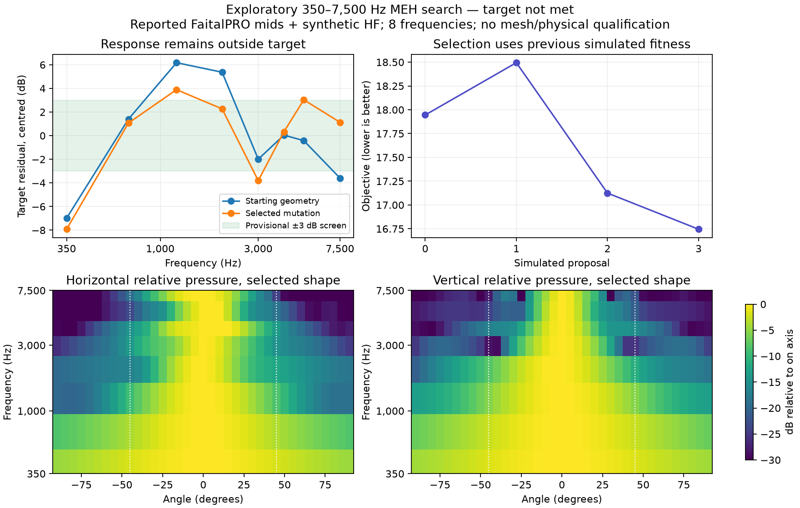

# First 350–7,500 Hz freeform search

This completed native four-proposal experiment used four reported FaitalPRO
3FE25 16-ohm mid circuits on one ring and an **explicitly synthetic HF circuit**.
The shared FEM/BEM solve retained all five source excitations and induced motion.
The source was the clean detached `a0a604e` worktree, with Boundary Lab pinned at
`8cb166226e412877d3f71f2845918e479b97aa85` and four Julia threads.

The search used 350, 700, 1,200, 2,000, 3,000, 4,000, 5,000 and 7,500 Hz. Its
frozen objective combines residual response variation about a 350 Hz LR4
high-pass target, H/V directivity error and a declared cost allowance. Upper
crossovers of 3, 4 and 5 kHz and common mid gain/polarity competed within each
geometry evaluation. This experiment used zero HF delay; later timing rescoring
of its baseline is diagnostic only and does not change its saved ranking.

| Proposal | Parent | Response variation, dB | Combined objective |
|---|---|---:|---:|
| 0 | declared baseline | 13.166 | 17.945 |
| 1 | 0 | 14.324 | 18.495 |
| 2 | 0 | 12.115 | 17.125 |
| 3 | 2 | 11.814 | 16.745 |

The loop selected proposal 3 and exported its exact geometry/BOM/DSP. This is a
working geometry-mutation/simulation/selection loop, **not an acceptable final
horn**. Its sampled variation remains 11.81 dB, and directivity target error is
9.17 dB. There is no held-out or mesh-convergence pass for this target-band run.
Native complex64 storage cannot pass the unchanged strict electrical gate.

The selected DSP uses mid gain 0.4, positive polarity and a 3 kHz upper crossover.
Four 16-ohm mids share one amplifier voltage. The complete current basis supplies
the frequency-dependent bank load, including mutual coupling and a zero-voltage
HF amplifier termination. Read the exact values in the preserved search report;
nominal driver impedances are not substituted for simulated load.

The winner's GBP 206.67 estimate comprises GBP 140 of driver allowances, GBP 11.67
of estimated print material with process allowance and GBP 55 of other allowance.
These are declared planning inputs, not a purchased commercial BOM or validated
print quote. The CAD still uses ideal diaphragm interfaces rather than qualified
mounts, baskets, cone profiles and gaskets for the named drivers.

The [1 V RMS operating report](../validation/evidence/wide-mid-target/operating-1vrms.json)
applies an explicit reference voltage **before** the saved DSP. It predicts
73.13 dB re 20 microPa at the saved on-axis point `(0,0,1)` m at 350 Hz and
90.90 dB at 1,200 Hz. These are linear model results including the synthetic HF,
not measured SPL, maximum output or safe limiter settings. It also retains
individual excursion, coil loss and signed amplifier power at every frequency.
See [operating predictions](operating-predictions.md) for the amplitude convention.

[Raw trial archives, controls, export and report](../validation/evidence/wide-mid-target/)
preserve every proposal. Do not substitute these results for Solana measurements
or advertise equivalence. The next search expands horn size and mid-driver area
because the compact starting family has not met the requested low handover.

