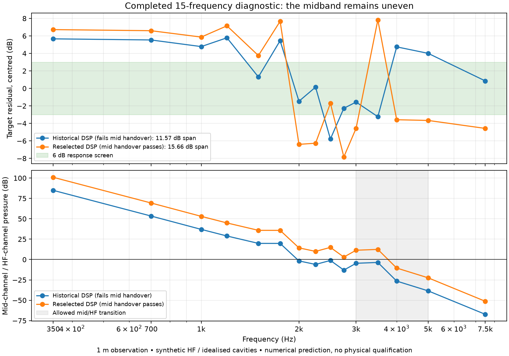

# Dense vocal-band sweep after a timeout

The historical larger-horn winner fails the response screen on the completed
15-frequency grid. Selecting DSP that keeps the mid channel dominant through
3 kHz and the HF channel dominant from 5 kHz gives **15.6617 dB** of target-relative
response variation against the unchanged **6 dB** limit. Its modelled four-driver
parallel bank remains above **3.13187 Ω** on these samples.

This is a failed candidate assessment, not a completed optimisation campaign or a
qualified physical horn. The added samples expose variation that the historical
eight-point sweep missed.

## Preserved failure and completion

The original four-proposal search used application source `e1a7a42`, the historical
mutated winner's geometry, a whole-sphere observation and these frequencies:
350, 700, 1000, 1200, 1500, 1750, 2000, 2250, 2500, 2750, 3000, 3500, 4000,
5000 and 7500 Hz. The first evaluation exceeded its 3600-second stage limit after
completing the first 13 samples. The remaining campaign was cancelled while the
second trial was compiling geometry.

The original search remains `cancelled`, trial zero remains `failed`, its managed
evaluation remains `timed_out`, and its incomplete native manifest is unchanged.
The partial manifest retains two missing entries. The cancelled second trial and
the two preparation attempts rejected before the supplementary solve are archived.

A separate solve using application source `b13c176` completed 4000, 5000 and 7500 Hz
in 786.07 seconds with a 7200-second stage limit. It used the **same original
project and meshes**, pinned BoundaryLab revision
`8cb166226e412877d3f71f2845918e479b97aa85`, `beat_cpu`, complex64 storage and four
Julia threads. Project snapshot, compiled system and both domain artifacts match
between the two runs.

The repeated 4 kHz arrays are exactly equal for every retained quantity: diaphragm
velocity, current, interior pressure, boundary pressure/normal derivative, both
polar cuts and the whole sphere. Relative complex norm errors are zero; exterior
magnitude/phase differences from division roundoff are below 1e-15 dB and
2.5e-15 degrees. No exterior samples are excluded by the declared relative-null
floor of 0.001.

The continuation controls declared 0.05 dB and 0.5-degree exterior limits and a
1e-5 current/velocity relative complex norm limit before the run. The assembly
implementation additionally applies that norm limit to **all** retained quantities.
The result passes both sets of checks; this repeatability test is not a mesh or
physical-accuracy test.

## Derived assessment

The [partial-frequency commands](partial-frequency-evidence.md) produce a separate
report selecting 13 original rows and the two missing supplementary rows. They do
not invent a completed native manifest. Initial inspection used source `d84db56`;
the reviewed assembly and diagnostic scoring used `c36e357`. The consumer rechecks
the source files and reconstructs the report to bind its project, runtime,
request, source statuses, overlaps and hash inventories to the actual artifacts.

The archived diagnostic runner uses the same DSP/scoring kernel whose original
native-score replay was checked in the
[audience-distance study](audience-distance-candidates.md). It consumes the verified
assembly directly, including mutually induced driver currents and pressure bases;
it does not alter the search or substitute a completed-evaluation verifier.

Of 252 DSP settings, 112 fail the declared acoustic handover constraint. The selected
remaining setting has mid gain 0.4, inverted mid polarity, 350 Hz LR4 high-pass,
4 kHz LR4 crossover and 0.15 ms HF delay. Its directivity error is 6.79860 dB and
acoustic objective is 19.06097. Selection minimises the existing combined response
and directivity objective; it is not a claim that this setting minimises ripple alone.

The historical 3 kHz DSP setting gives 11.5654 dB variation on the same 15-point
basis and fails mid dominance at 2000, 2250, 2500, 2750 and 3000 Hz. Neither result
passes the complete target. The midband dips motivate a separate geometry experiment
with larger entry ports and shallower idealised front cavities.

## Evidence and limits

[Machine-readable report and archive hashes](../validation/evidence/wide-vocal-completion/report.json)
cover the complete cancelled search, supplementary native solve, immutable assembly,
scoring, plots, controls and exact runners. Every ZIP passed CRC verification and
is below GitHub's 100 MB file limit. Extract all numbered original-search archives
together to recover its full directory; no original native file is rewritten.

The study uses 1 m observations, 413 sphere points and two 73-point polar cuts.
It does not establish far-field behaviour, held-out-frequency accuracy or mesh
convergence. Complex64 storage does not pass the unchanged 1e-8 electrical
qualification gate. The mid circuits are reported FaitalPRO parameters; the HF is
synthetic and the cavities/source planes remain idealised. No measured cone/chamber
geometry, real driver fit, absolute SPL, amplifier qualification, physical measurement,
print qualification or Solana performance equivalence is established.
